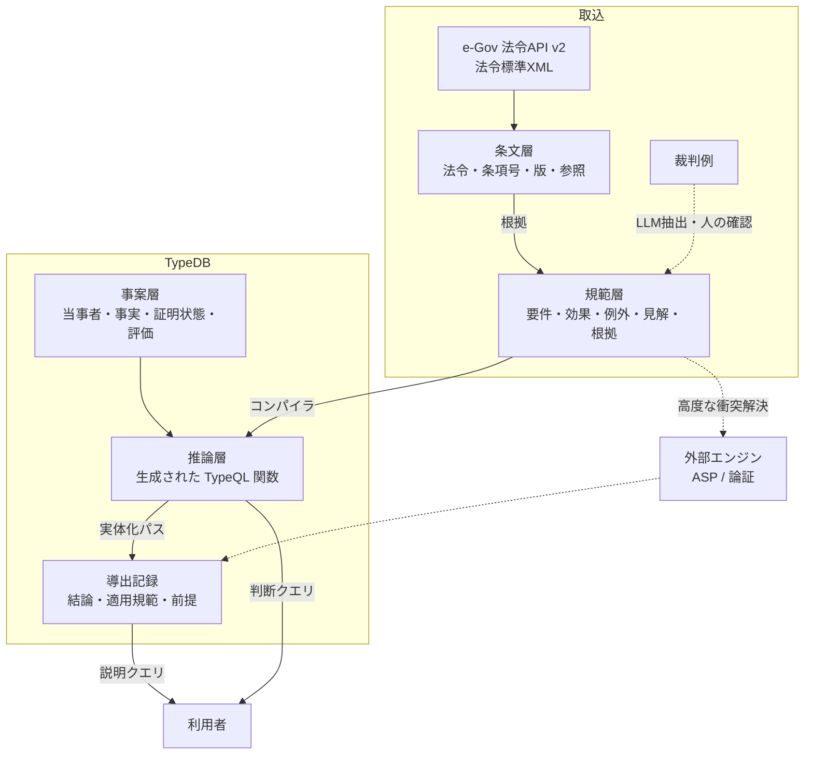

# 3. TypeDB での表現・推論方式の比較

## 3.1 前提: TypeDB 3.x の推論機能

TypeDB 3.0 では、2.x の「ルール（`rule ... when ... then`）」が廃止され、**関数（`fun`）**に置き換えられました。設計に関わる性質は次のとおりです。

| 性質 | 内容 | 法的推論への影響 |
|------|------|----------------|
| 関数の戻り値 | ストリーム（`-> { type, ... }` / `return { $x, ... };`）または単一値（`return first` / `return check` / 集約） | 「効果が認められる事案・当事者の組」をストリームで返せる |
| 呼び出し | `match` の中で `let $x in f(...)` や `let $v = f(...)` | 結論を他の推論の前提として合成できる |
| 再帰 | ストリーム関数を介した再帰が可能。テーブリングで循環を打ち切る | 準用の連鎖、権利の承継など推移的な関係を表せる |
| 否定 | `not { ... }`。再帰と組み合わせる場合は**層化されている必要がある**（否定の評価が自分自身の再帰呼び出しに依存してはならない） | 原則→例外→例外の例外の層構造は層化されているので書ける。汎用のメタ解釈器（自分自身を否定の中で呼ぶ）は書けない |
| データの書き込み | 関数は**データを生成・書き込みしない**（2.x のルールのように推論結果を仮想的なデータとして見せることもしない） | 推論結果を永続化・説明するには、アプリケーション側で書き戻す必要がある |
| スキーマとの分離 | 関数はスキーマ（`define`）の一部として定義する | 規範を関数にすると、規範の変更はスキーマ変更になる |

この性質を踏まえて、5 つの方式を比較します。

## 3.2 方式 A: 条文構造モデル（文書グラフ）

法令標準XMLの構造をそのままエンティティ・関係に写します。

- 法令、編・章・節・款・目、条・項・号、文（本文・ただし書）、附則、版（時点）
- 参照関係: 「前項」「第○条」「準用する」「読み替える」の解析結果

**できること**: 条文の検索・表示、時点を指定した条文の取得、準用・参照の連鎖（再帰関数）、改正による影響範囲の調査。
**できないこと**: 法的判断（要件と効果の意味を持たないため）。

→ 単独では不十分ですが、**全方式の土台**になります。

## 3.3 方式 B: 規範をデータとして表現し、汎用評価器で評価する

規範（要件→効果）を、エンティティ・関係のインスタンスとして格納します。

```
norm ─ conclusion → legal-effect
     ─ condition  → requirement（AND/OR の木）
     ─ source     → provision（根拠条文）/ precedent（判例）
norm ─ exception-of → norm（例外関係。層の深さを持つ）
```

事案の事実を `fact-finding`（証明状態つき）として入れ、TypeQL の汎用関数で「要件がすべて証明され、例外が成立しない規範」を探します。

- **利点**: 規範がデータなので、検索・追加・版管理・根拠との対応づけが自由にできます。「効果 X を導きうる規範をすべて挙げよ」「この判例に依拠する規範は」といったメタなクエリも書けます。
- **難点**:
  1. 汎用評価器は「例外の評価のために自分自身を否定の中で呼ぶ」構造になり、**層化否定の制約に抵触します**。回避するには、層ごとに関数を分ける（`holds_depth0`, `holds_depth1`, ...、最大の深さを固定）必要があります。
  2. 要件が変数（「売主」「買主」「目的物」など）を共有する一階の規則を、汎用的な役割の束縛として表すと、照合が複雑で遅くなります。命題的な規則（事案ごとに具体化した要件）に限れば現実的です。

## 3.4 方式 C: 規範を TypeQL 関数として直接記述する

各規範（または条文の項）を、ドメインの型（契約、意思表示、当事者など）の上で動く TypeQL 関数として書きます。

```typeql
fun mistake_cancellable() -> { declaration-of-intent }:   # 95条1項
match ... not { let $d in gross_negligence_bar(); };        # 95条3項
return { $d };
```

- **利点**: TypeDB のネイティブな照合・最適化がそのまま効き、一階の規則（変数の共有）も自然に書けます。原則→例外の層は関数の呼び出し関係として表せ、層化の条件も自然に満たします。
- **難点**: 規範が「コード」になるため、根拠条文との対応、見解の切替、版管理をデータとして扱えません。法律家が直接メンテナンスするのは難しく、導出の過程（どの関数を経たか）も返りません。

## 3.5 方式 D: TypeDB を知識グラフとし、外部エンジンで推論する

TypeDB は法令・規範・判例・事案を保持する知識グラフに徹し、推論は外部の専用エンジンが担当します。結果は TypeDB に書き戻します。

- 外部エンジンの候補: PROLEG / SWI-Prolog（要件事実）、Answer Set Programming（clingo: 非層化の否定、複数の解答集合＝複数の結論候補）、ASPIC+ 系の論証エンジン（対立する主張の評価）
- **利点**: 非層化の否定、規則の優先関係による衝突解決、論証の比較など、TypeDB 関数では書きにくい推論ができます。
- **難点**: 2 つのシステムの間で同期・変換が必要で、「クエリ 1 本で判断を引き出す」体験から遠ざかります。

## 3.6 方式 E: LLM による規範・事実の抽出

条文テキストや判決文から規範（要件・効果・例外）の候補を、事案の叙述から事実の候補を、LLM で抽出します。人の確認を経て規範層・事案層に登録します。

- **利点**: 規範化の作業コストを大きく下げられます。規範的要件の当てはめについて、評価根拠事実・評価障害事実の候補を挙げる用途にも使えます。
- **難点**: 誤りが混入するため、人の確認と出典の紐づけが必須です。推論そのものは LLM に任せず、TypeDB 側の決定的な推論で行うべきです（結論の再現性と説明可能性のため）。

## 3.7 比較

| 観点 | A 条文 | B 規範データ＋汎用評価 | C 規範＝関数 | D 外部エンジン | E LLM 抽出 |
|------|:---:|:---:|:---:|:---:|:---:|
| 法的判断をクエリで得られる | × | △（命題的な規則なら可） | ◎ | ○（書き戻し後） | — |
| 根拠条文・判例との対応 | ◎ | ◎ | △ | ○ | ○ |
| 見解の切替・版管理 | ◎ | ◎ | × | ○ | — |
| 一階の規則（変数の共有） | — | △ | ◎ | ◎ | — |
| 例外の層構造 | — | △（深さを固定） | ◎ | ◎ | — |
| 規則の衝突・非層化の否定 | — | × | × | ◎ | — |
| 導出過程の説明 | — | △ | △ | ◎ | — |
| 実行性能 | ◎ | △ | ◎ | ○ | — |
| 規範作成のコスト | 低（自動取込） | 中 | 高 | 中〜高 | 低（要確認） |

## 3.8 推奨: 規範をデータで持ち、関数にコンパイルするハイブリッド構成

B と C の長所を組み合わせ、**「規範の正本はデータ（B）、実行は生成した関数（C）」**とします。A を土台に置き、E で作成を支援し、D は必要になった段階で追加します。



1. **条文層（A）**: e-Gov 法令API から自動で取り込みます。
2. **規範層（B）**: 規範を「要件の木＋効果＋例外関係＋根拠＋見解＋有効期間」として格納します。法律家がレビューする対象は、この層です。
3. **コンパイラ**: 規範層を読み、例外の層構造に沿って TypeQL 関数を生成し、`define` で登録します。層ごとに関数が分かれるため、層化否定の制約を自動的に満たします。見解や時点ごとに関数を生成し分けたり、引数で切り替えたりできます。
4. **事案層**: 当事者・行為・事実と、その証明状態（`admitted` / `proven` / `unclear` / `disproven`）を持ちます。
5. **判断クエリ**: 生成された関数を `match` で呼び出し、結論を得ます。
6. **実体化パス（materialization）**: アプリケーションが関数を実行し、結論・適用した規範・充足した前提を `derivation` 関係として書き戻します。これで「なぜその結論か」をグラフとしてたどれ、監査や再現にも使えます（TypeDB 3.x の関数はデータを書かないため、このパスが説明可能性の要になります）。

この構成によって、次のような判断・分析をクエリで引き出せます。

| クエリの種類 | 例 |
|-------------|----|
| 結論 | 事案 X で、原告の代金支払請求は認められるか |
| 根拠 | その結論はどの条文・判例・見解に基づくか（導出記録の探索） |
| 不足事実 | 結論を覆すには、どの当事者がどの事実を立証すればよいか（真偽不明の要件事実の列挙） |
| 見解比較 | 判例の立場と有力説の立場で結論はどう変わるか |
| 時点比較 | 意思表示が 2020年3月31日なら（旧95条）どうなるか |
| 影響分析 | 条文 Y が改正されたら、どの規範・どの事案の結論が変わるか |
| 法令ナビ | ある規定を準用しているのはどの条文か（再帰的な参照の探索） |
