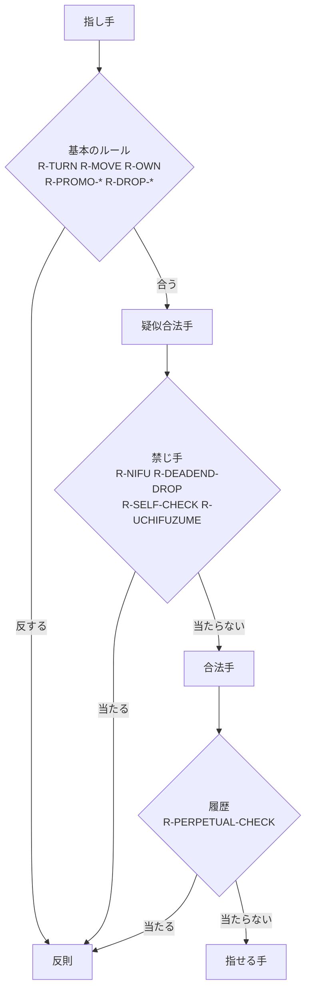

# 1. 調査: 判定の対象になる将棋のルール

AI の指し手がルールに合っているかを判定するために、どのルールを表す必要があるかを整理します。各ルールには、判定結果で使う **ルール ID** を付けます。

> 根拠: 将棋の基本的なルールと、公式戦での反則の扱いは、日本将棋連盟の対局規定に定められています。本書のルールの記述は一般に知られているルールに基づくもので、実装の段階で対局規定の条文と照合し、ルールごとに出典を記録します（[05](05-roadmap.md)）。

## 1.1 盤と駒

- 盤は 9×9 の 81 マス。筋（縦の列）を 1〜9、段（横の行）を一〜九で表す。先手から見て右上が 1 一
- 先手（▲）と後手（△）が交互に 1 手ずつ指す。先手が先に指す
- 駒は 8 種類。うち 6 種類は成ることができる

| 駒 | 記号（USI） | 成ると | 動き |
|----|-----------|-------|------|
| 玉（王） | K | — | 周囲 8 マスに 1 マス |
| 飛車 | R | 竜（龍王） | 縦横に何マスでも |
| 角行 | B | 馬（龍馬） | 斜めに何マスでも |
| 金将 | G | — | 前・斜め前・横・後ろに 1 マス（斜め後ろ以外の 6 方向） |
| 銀将 | S | 成銀 | 前・斜め前・斜め後ろに 1 マス（5 方向） |
| 桂馬 | N | 成桂 | 2 マス前の左右のどちらか（間の駒を飛び越える） |
| 香車 | L | 成香 | 前に何マスでも |
| 歩兵 | P | と金 | 前に 1 マス |
| 竜 | +R | — | 飛車の動き＋斜めに 1 マス |
| 馬 | +B | — | 角の動き＋縦横に 1 マス |
| 成銀・成桂・成香・と金 | +S・+N・+L・+P | — | 金と同じ |

- 「何マスでも」の駒（飛車・角・香、竜・馬の一部）は、途中に駒があればそこで止まる（相手の駒なら取れる、自分の駒ならその手前まで）
- 自分の駒がいるマスには動けない。相手の駒がいるマスに動くと、その駒を取る

| ID | ルール |
|----|-------|
| R-TURN | 手番の側の駒しか動かせない |
| R-MOVE | 駒は、その駒の動きで行けるマスにしか動けない（飛び駒は途中に駒があれば止まる） |
| R-OWN | 自分の駒がいるマスには動けない |

## 1.2 成り

- 敵陣（相手側の 3 段。先手なら一〜三段）に入るとき、敵陣の中で動くとき、敵陣から出るときに、成るか成らないかを選べる
- 成った駒は元に戻らない
- 玉と金、すでに成っている駒は成れない
- その先に動けなくなる駒は、必ず成らなければならない: 歩・香は最奥の 1 段、桂は最奥の 2 段に、成らずに進めない

| ID | ルール |
|----|-------|
| R-PROMO-ZONE | 成れるのは、移動元か移動先が敵陣のときだけ |
| R-PROMO-PIECE | 玉・金・成った駒は成れない |
| R-PROMO-MANDATORY | 行き所のなくなる駒（最奥の段の歩・香、奥 2 段の桂）は、成らなければならない |

## 1.3 持ち駒

- 相手の駒を取ると、自分の持ち駒になる。成っていた駒は元の駒に戻る
- 自分の手番に、移動の代わりに、持ち駒を空いているマスに打てる。打った駒は成っていない状態で置かれる

| ID | ルール |
|----|-------|
| R-DROP-HAND | 持っていない駒は打てない |
| R-DROP-EMPTY | 駒のいるマスには打てない |

## 1.4 禁じ手

動きとしては可能でも、してはいけない手です。公式戦では、指すと反則負けになります。

| ID | 禁じ手 | 内容 |
|----|-------|------|
| R-NIFU | 二歩 | 成っていない自分の歩がある筋に、歩を打つこと（と金は数えない） |
| R-DEADEND-DROP | 行き所のない駒を打つ | 歩・香を最奥の段に、桂を奥 2 段に打つこと |
| R-UCHIFUZUME | 打ち歩詰め | 歩を打って相手の玉を詰ませること（歩を盤上で進めて詰ませる「突き歩詰め」は反則ではない） |
| R-SELF-CHECK | 王手放置・自玉を取られる位置に動かす | 指した後に、自分の玉が相手の駒の利きにある手 |
| R-PERPETUAL-CHECK | 連続王手の千日手 | 千日手（1.5）のうち、一方が王手をかけ続けていた場合は、王手をかけていた側の反則 |

二歩・行き所のない駒・打ち歩詰め・王手放置は、**その 1 手と局面だけで判定できる**禁じ手です。連続王手の千日手は、**対局の履歴**が必要です。

## 1.5 千日手

- 同じ局面（盤上の配置・両者の持ち駒・手番がすべて同じ）が 4 回現れたら千日手。公式戦では指し直しになる
- ただし、一方の指し手がすべて王手だった場合（連続王手の千日手）は、王手をかけていた側の反則負け

千日手そのものは反則ではなく、対局の結果（引き分け扱いの指し直し）です。判定の対象は、連続王手の千日手（R-PERPETUAL-CHECK）と、「この手で千日手が成立する」ことの通知です。

## 1.6 対象外にするもの

| ルール | 理由 |
|-------|------|
| 持将棋・入玉宣言法 | 点数の計算と宣言の手続きが必要。指し手 1 つの判定とは性質が違う。後の段階で検討 |
| 時間切れ・二手指し・待ったなど | 対局の運営に関するもので、指し手の内容の判定ではない |
| 手番を間違えた指し手 | R-TURN として扱う |

## 1.7 判定に必要な情報

| 判定 | 必要な情報 |
|------|----------|
| R-TURN, R-MOVE, R-OWN, R-PROMO-*, R-DROP-*, R-NIFU, R-DEADEND-DROP | 局面と指し手 |
| R-SELF-CHECK | 指した後の局面 |
| R-UCHIFUZUME | 歩を打った後の局面と、その局面での相手の合法手（＝相手の全指し手それぞれについて、指した後の局面で王手が残るか） |
| R-PERPETUAL-CHECK、千日手の成立 | 対局の履歴（過去の局面と、各手が王手だったか） |

打ち歩詰めは、「相手に逃れる手が 1 つもない」ことを確かめる必要があり、**2 手先の局面まで**評価が要ります。判定の中で最も重いものです（[03](03-design.md#35-指した後の局面が必要な判定)）。

## 1.8 ルールの構造

「動きとして可能な手（原則）」から「禁じ手（例外）」を除く、という構造は、法律の「請求原因から抗弁を除く」と同じです。
