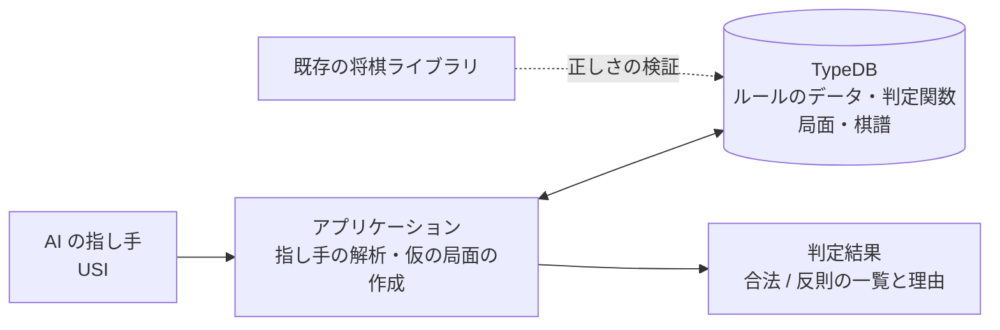

# 2. 方式の比較

将棋のルールを、どこに・どう書くかの選択肢を比べます。

## 2.1 選択肢

| 方式 | 内容 |
|------|------|
| A. 既存のライブラリに任せる | Python などの将棋ライブラリ（合法手の生成、反則の判定ができるもの）で判定し、TypeDB は使わない |
| B. ルールをすべてアプリケーションのコードに書く | 自前の Python コードで判定し、TypeDB は局面と棋譜の保存だけに使う |
| C. ルールを TypeDB のデータと関数で表す | 駒の動き・盤の形をデータで持ち、反則の判定を TypeDB の関数で書く |
| D. C ＋ 重い判定だけアプリケーションで補う | 1 手と局面で決まる判定は TypeDB の関数、指した後の局面が要る判定はアプリケーションが仮の局面を作って TypeDB に問い合わせる |

## 2.2 比較

| 観点 | A ライブラリ | B コード | C TypeDB のみ | D TypeDB＋補助 |
|------|:---:|:---:|:---:|:---:|
| 判定の正しさ（すぐに得られるか） | ◎ | ○ | △ | ○ |
| 速さ | ◎ | ◎ | △ | ○ |
| 反則の理由をルール単位で返せる | △（合法かどうかが中心） | ○ | ◎ | ◎ |
| ルールに出典・説明を結びつけられる | × | △ | ◎ | ◎ |
| ルールの変更・変種（将棋の変種、独自ルール）への対応 | × | △（コードの変更） | ◎（データの変更） | ◎ |
| 局面・棋譜・反則の記録を横断して問い合わせる | × | △ | ◎ | ◎ |
| 打ち歩詰め・千日手などの重い判定 | ◎ | ◎ | △（2 手先の評価をすべて関数で書く必要） | ○ |
| 法律など他の分野への展開 | × | × | ○ | ◎ |

◎ とても向いている、○ 向いている、△ 工夫が要る、× 向いていない

## 2.3 考察

### ライブラリ（A）は「正解の基準」として使う

既存のライブラリは速く正確で、合法かどうかの判定だけなら最善です。しかし、

- 「なぜ反則か」を、ルール単位で、出典つきで返すことは目的にしていない
- ルールそのものがコードに埋め込まれていて、データとして問い合わせたり、変種に差し替えたりできない

という点で、この提案の目的（AI の出力をルールで検査し、理由を説明する仕組みを作る）には足りません。そこで A は、**C・D の判定結果が正しいかを確かめる基準**として使います（[05](05-roadmap.md)）。

### TypeDB だけ（C）は重い判定で無理が出る

駒の動き・二歩・王手の判定は、試作で TypeDB の関数として書けることを確かめました（[03](03-design.md#38-試作で確かめたこと)）。一方、打ち歩詰めは「歩を打った後の局面で、相手のすべての指し手について、指した後の局面で王手が残るか」を調べる必要があります。TypeDB の関数はデータを書けないので、仮の局面を関数の中で表すことになり、関数が複雑になります。

### 推奨: D（TypeDB＋補助）

- **ルールの正本は TypeDB**: 駒の動き、成りの対応、行き所のない段、ルール ID と出典・説明は TypeDB のデータ。1 手と局面で決まる判定は TypeDB の関数
- **アプリケーションは手順だけを担う**: 指し手を受け取り、指した後の局面を TypeDB に書き込み（仮の局面）、TypeDB の関数で王手や合法手を問い合わせる。ルールの判断そのものはコードに書かない
- 打ち歩詰めを TypeDB の関数だけで判定する方法（盤の状態を「指し手を適用した後の仮想的な配置」として関数で表す）は、フェーズ3で試し、仮の局面を書き込む方法と速さを比べる

