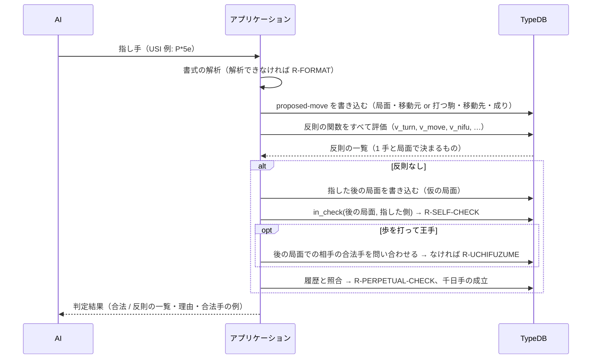

# 3. 推奨構成の設計

[02](02-approaches.md) の方式 D（ルールと判定は TypeDB、手順はアプリケーション）を、TypeQL（TypeDB 3.x）で具体化します。3.2〜3.4 の盤・駒・局面と利きの関数は、試作（[prototype/schema.tql](prototype/schema.tql)）として TypeDB 3.13 で動作を確かめています。3.5 以降は設計案です。

## 3.1 層の構成

| 層 | 中身 | 変わる頻度 |
|----|------|----------|
| 盤の層 | 81 マスと、マスどうしの位置関係 | 変わらない |
| ルール層 | 駒の種類・動き・成りの対応・行き所のない段、ルール（ID・説明・出典） | ルールの変種を扱うときだけ |
| 局面層 | 局面（駒の配置・持ち駒・手番）、対局と棋譜 | 1 手ごと |
| 判定層 | 判定する指し手と、反則ごとの判定関数、判定結果 | 判定のたび |

## 3.2 盤: マスと位置関係をデータにする

盤を 81 個のマス（`square`）と、「マス A から (df, dr) だけずれたマスが B」という位置関係（`geometry`）で表します。方向は、8 方向と桂馬の 4 方向の計 12 種類で、関係は 900 件ほどです。

```typeql
entity square, owns square-id @key, owns file, owns rank,
  plays geometry:origin, plays geometry:target, plays occupancy:square;
relation geometry, relates origin, relates target, owns df, owns dr;
```

座標の足し算（`5 + 1 = 6`）をクエリの中で行う代わりに、**隣のマスをデータとしてたどる**形です。試作の最初は座標の計算で書きましたが、TypeDB 3.13 では値（整数）を返す関数の中で `or` を使うと型の検査でエラーになる（3.8）ため、この形にしました。盤の形がデータなので、盤の大きさが違う変種にもデータの変更で対応できます。

## 3.3 ルール層: 駒の動きをデータにする

駒の種類（`piece-type`）ごとに、動き（`step`: 方向と、何マスでも進めるか）を持たせます。動きは先手の向きで書き、後手は向きを反転（`sign = -1`）して使います。

```typeql
entity piece-type, owns piece-code @key, owns piece-name, owns last-ranks-forbidden,
  plays movement:piece, plays promotion:base, plays promotion:promoted, ...;
entity step, owns df, owns dr, owns slides, plays movement:step;
relation movement, relates piece, relates step;
relation promotion, relates base, relates promoted;      # 歩 → と金 など
```

| データ | 例 |
|-------|-----|
| 金の動き | (−1,−1) (0,−1) (1,−1) (−1,0) (1,0) (0,1)、どれも 1 マス |
| 飛車の動き | (0,−1) (−1,0) (1,0) (0,1)、どれも何マスでも |
| 竜の動き | 飛車の 4 方向（何マスでも）＋ 斜め 4 方向（1 マス） |
| 成りの対応 | 歩 → と金、香 → 成香、…、角 → 馬、飛 → 竜 |
| 行き所のない段 | 歩・香 1、桂 2 |

ルールそのもの（ID・説明・出典）もデータとして持ちます。判定結果は、このルールを指します。

```typeql
entity rule, owns rule-id @key, owns rule-label, owns rule-text, owns source-ref,
  plays violation:rule;
```

## 3.4 局面層と、利きの関数

局面（`position`）は、駒の配置（`occupancy`: 局面・マス・駒の種類・持ち主）、持ち駒（`in-hand`）、手番（`turn`）からなります。

```typeql
relation occupancy, relates position, relates square, relates piece, relates owner;
relation in-hand, relates position, relates piece, relates owner, owns amount;
relation turn, relates position, relates player;
```

利き（その駒が動ける・取れるマス）は、次の関数で求めます（試作で動作確認済み）。

```typeql
# $s から ($df, $dr) の方向に進んで届くマス（最初にぶつかった駒のマスを含む）
fun ray($p: position, $s: square, $df: integer, $dr: integer) -> { square }:
match
  { let $t in next_square($s, $df, $dr); } or
  { let $m in next_square($s, $df, $dr); let $t in ray_beyond($p, $m, $df, $dr); };
return { $t };

# 空きマスなら、その先へ進む
fun ray_beyond($p: position, $m: square, $df: integer, $dr: integer) -> { square }:
match
  not { occupancy (position: $p, square: $m); };
  let $t in ray($p, $m, $df, $dr);
return { $t };
```

| 関数 | 意味 |
|------|------|
| `reach($p, $pl, $pt, $s)` | 駒 $pt が $s から利いているマス |
| `attacks($p, $pl)` | $pl の駒の利きがあるマス |
| `board_moves($p)` | 手番の側の盤上の駒の移動（疑似合法手のうち、移動するもの） |
| `in_check($p, $pl)` | $pl の玉に王手がかかっているか |
| `pawn_on_file($p, $pl, $f)` | $pl の歩が筋 $f にあるか（二歩の判定） |

## 3.5 指し手の判定の流れ



### 判定する指し手

```typeql
entity proposed-move, owns move-text, owns promote,
  plays move-of:move, plays move-from:move, plays move-to:move, plays move-drop:move,
  plays violation:move;
relation move-of, relates move, relates position;            # どの局面での指し手か
relation move-from, relates move, relates square;            # 移動元（盤上の駒を動かすとき）
relation move-to, relates move, relates square;              # 移動先
relation move-drop, relates move, relates piece;             # 打つ駒（持ち駒を打つとき）
```

### 反則ごとの関数

法律の提案の「規範ごとの関数」と同じ形で、反則ごとに「その指し手が反則なら、指し手を返す」関数を作ります。

```typeql
# R-NIFU 二歩: 歩を打つ筋に、自分の成っていない歩がある
fun v_nifu($m: proposed-move) -> { proposed-move }:
match
  move-of (move: $m, position: $p);
  $pawn isa piece-type, has piece-code "P";
  move-drop (move: $m, piece: $pawn);
  move-to (move: $m, square: $t); $t has file $f;
  turn (position: $p, player: $pl);
  let $x in pawn_on_file($p, $pl, $f);
return { $m };

# R-MOVE 駒の動きで行けないマスへの移動
fun v_move($m: proposed-move) -> { proposed-move }:
match
  move-of (move: $m, position: $p);
  move-from (move: $m, square: $s); move-to (move: $m, square: $t);
  turn (position: $p, player: $pl);
  occupancy (position: $p, square: $s, piece: $pt, owner: $pl);
  not { let $t in reach($p, $pl, $pt, $s); };
return { $m };
```

| 関数 | ルール | 判定に使うもの |
|------|-------|-------------|
| `v_turn` | R-TURN | 移動元の駒の持ち主と手番 |
| `v_move` | R-MOVE | `reach` |
| `v_own` | R-OWN | 移動先・打つマスの占有 |
| `v_promo_zone` / `v_promo_piece` / `v_promo_mandatory` | R-PROMO-* | 段・成りの対応・行き所のない段 |
| `v_drop_hand` / `v_drop_empty` | R-DROP-* | 持ち駒・占有 |
| `v_nifu` | R-NIFU | `pawn_on_file` |
| `v_deadend_drop` | R-DEADEND-DROP | 行き所のない段 |

アプリケーションは、すべての `v_` 関数を評価し、返ってきた反則を `violation`（指し手・ルール）として記録します。**反則が複数あれば、すべて返します**（AI に理由を伝えるため）。

### 指した後の局面が必要な判定

TypeDB の関数はデータを書けないので、王手放置と打ち歩詰めは、アプリケーションが指した後の局面を書き込んでから評価します。

| ルール | 手順 |
|-------|------|
| R-SELF-CHECK | 後の局面 P′ を書き込み、`in_check(P′, 指した側)` |
| R-UCHIFUZUME | 歩を打って `in_check(P′, 相手)` なら、P′ での相手の合法手を求める。相手の疑似合法手それぞれについて、さらに後の局面 P″ を作り、`in_check(P″, 相手)` が残らないものが 1 つでもあれば詰みではない |

打ち歩詰めの判定は、相手の疑似合法手の数（多くても 100 程度）だけ仮の局面を作るので重くなりますが、**歩を打って王手になったときだけ**行うので、全体への影響は小さいと見込んでいます。仮の局面は判定のあとに削除します。

フェーズ3では、仮の局面を書き込まずに、「指し手を適用した後の配置」を返す関数（`occupancy_after($p, $m)`）を作り、王手の判定をその上で行う方法を試し、速さと書きやすさを比べます。

## 3.6 合法手の生成

`board_moves`（盤上の駒の移動）と、持ち駒を打つ手（`drop_moves`）を合わせて疑似合法手を作り、成り・不成の選択を展開し、反則の関数で除けば、全合法手が得られます。合法手の生成は次の用途に使います。

- AI への反則の説明に「この局面での合法手の例」を添える（[04](04-ai-integration.md)）
- 打ち歩詰めの判定（相手の合法手が 0 か）
- 正しさの検証（perft。[05](05-roadmap.md)）

## 3.7 対局と履歴

```typeql
entity game, owns game-id @key, plays game-ply:game;
relation game-ply, relates game, relates position, relates move, owns ply, owns gives-check;
attribute sfen, value string;     # 局面の文字列表現（同一局面の判定に使う）
```

局面ごとに SFEN（盤・持ち駒・手番）を持たせ、同じ SFEN の局面が 4 回現れたら千日手です。その間の一方の手がすべて王手（`gives-check true`）なら、R-PERPETUAL-CHECK です。

## 3.8 試作で確かめたこと

[prototype/schema.tql](prototype/schema.tql) を TypeDB CE 3.13.6 で検証しました（`python scripts/verify_shogi_prototype.py`）。

| 確かめたこと | 結果 |
|------------|------|
| 初期局面の先手の指し手（`board_moves`） | 30 通り（正しい値） |
| 飛び駒の利きが、駒にぶつかったところで止まる（`reach`） | 初期局面の飛車 9 マス、5五の飛車 16 マス（どちらも正しい値） |
| 王手の判定（`in_check`） | 飛車による王手を検出し、間に歩があれば王手でないと判定 |
| 二歩の判定（`pawn_on_file`） | 正しく判定 |
| 実行時間 | スキーマ・ルール・3 局面の投入と 8 項目の検証で約 1 秒 |

TypeDB 3.13 について分かったこと（[07](../07-phase1-results.md#75-typedb-313-で分かったこと)・[08](../08-phase2-results.md#88-typedb-313-で分かったことの続き) の続き）:

| 事項 | 内容 | 対応 |
|------|------|------|
| 値を返す関数の中の `or` | 戻り値の変数（整数）を `or` の各分岐で代入すると、CEX7・CEX18 のエラーになる | 盤をマスのエンティティにし、関数は概念（マス）を返す。概念を返す `or` は問題ない |
| 属性を値の引数に渡す | `has file $f` の `$f`（属性）を、整数の引数に直接渡すと REP35 | マスのエンティティを渡す。値が要るときは `==` で比べる |
| 否定と `or` | 分岐の中の否定は避ける | `ray` と `ray_beyond` のように、否定を別の関数に分ける（法律の提案と同じ） |

## 3.9 法律の提案から再利用するもの

| 法律の提案 | 将棋での使い方 |
|----------|-------------|
| 規範ごとの関数（`h_` / `c_`） | 反則ごとの関数（`v_`） |
| 根拠条文との対応と、文言の自動照合 | ルール ID と対局規定の出典との対応 |
| 評価レポート（結論・論証・不足事実・注意） | 判定結果（合法／反則の一覧・理由・合法手の例） |
| 期待つきの事案テスト | 期待つきの局面・指し手のテストと、ライブラリとの突き合わせ |
| 関数を対象（訴訟物）ごとの引数にする | 判定する指し手・局面を引数にする（全件を評価し直さない） |
