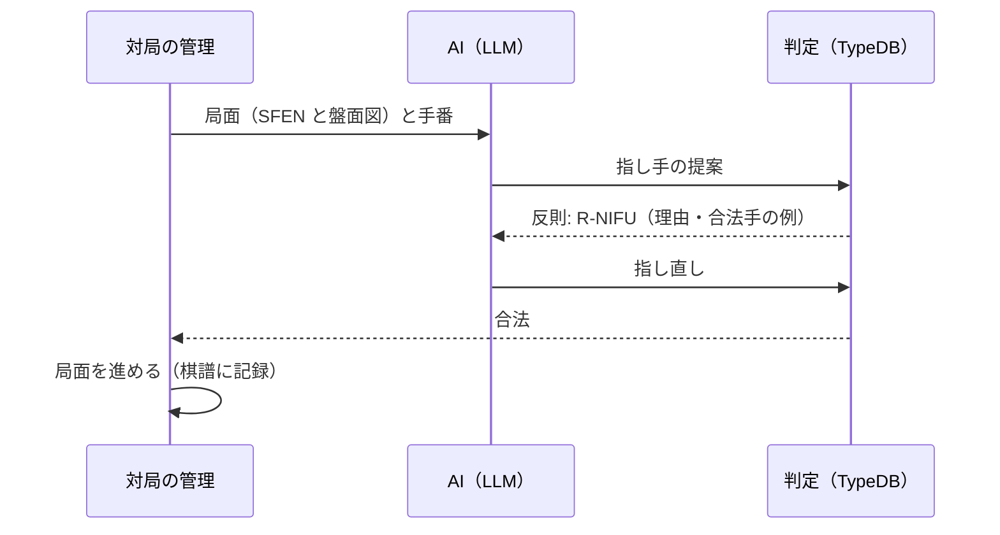

# 4. AI との組み合わせ

AI（LLM や将棋エンジン）が提案した指し手を、TypeDB のルールで判定し、反則なら理由を返して指し直させる仕組みを設計します。

## 4.1 役割分担

| 役割 | 担当 | 理由 |
|------|------|------|
| 指し手を考える（強さ） | AI（LLM、将棋エンジン） | 探索と評価は AI の領分。TypeDB は扱わない |
| 指し手がルールに合うかを判定する | TypeDB（ルールのデータと判定関数） | 正確さと一貫性、ルール単位の理由 |
| 反則の理由をわかりやすく説明する | LLM（判定結果をもとに） | 言葉の部分 |
| 判定の正しさを保証する | 既存の将棋ライブラリとの突き合わせ | 機械的に確かめられる |

LLM は将棋の指し手を文章で提案できますが、二歩・打ち歩詰め・王手放置などの反則や、存在しない駒を動かす誤りをすることがあります。とくに局面が複雑になると、盤面の把握を誤りやすくなります。TypeDB はこれを確実に見つけ、**どのルールに、なぜ反するか**を返します。

## 4.2 指し手の受け取り

AI には USI 形式で指し手を出力させます。

| 指し手 | USI | 意味 |
|-------|-----|------|
| ▲7六歩 | `7g7f` | 7七の駒を 7六へ（筋は数字、段は a〜i） |
| ▲2二角成 | `8h2b+` | 8八の駒を 2二へ動かして成る |
| ▲5五歩打 | `P*5e` | 持ち駒の歩を 5五に打つ |

日本語の棋譜（「▲7六歩」）で受け取る場合は、変換の段階を挟みます。解析できない指し手は `R-FORMAT`（書式の誤り）として返します。

## 4.3 判定結果

判定結果は、AI がそのまま読める構造化データで返します。

```json
{
  "move": "P*5e",
  "legal": false,
  "violations": [
    {
      "rule": "R-NIFU",
      "label": "二歩",
      "reason": "5筋に先手の歩（5七）があるため、5筋に歩を打てない",
      "source": "日本将棋連盟 対局規定（反則）"
    }
  ],
  "legal_move_examples": ["7g7f", "2g2f", "P*4e"],
  "position": "lnsgkgsnl/1r5b1/ppppppppp/9/9/9/PPPPPPPPP/1B5R1/LNSGKGSNL b - 1"
}
```

| 項目 | 内容 |
|------|------|
| `violations` | 反則の一覧。ルール ID・名前・理由（具体的なマスと駒）・出典 |
| `legal_move_examples` | 合法手の例（AI が指し直すときの手がかり。全合法手を返すこともできる） |
| `position` | 判定した局面（SFEN）。AI と判定側で局面の認識がずれていないかを確かめるため |

理由の文（`reason`）は、判定関数が見つけたマスや駒からテンプレートで作ります。LLM に書かせると、もっともらしいが誤った理由を書くおそれがあるためです（[docs/userguide 第17章](../../userguide/17-llm-and-ontology.md)の「根拠はオントロジーから取る」）。LLM には、この結果をもとに、利用者向けの説明を書かせます。

## 4.4 提案と判定のループ



- 反則なら、理由と合法手の例を AI に返して指し直させる。指し直しの回数に上限を設ける
- 合法なら局面を進め、棋譜（[03](03-design.md#37-対局と履歴)）に記録する
- 判定の結果は、反則の種類・回数とともに記録する

判定は **MCP（Model Context Protocol）のツール**として公開すると、Claude などの AI から直接呼べます。

| ツール | 入力 | 出力 |
|-------|------|------|
| `validate_move` | 局面（SFEN）、指し手（USI） | 判定結果（4.3） |
| `legal_moves` | 局面 | 全合法手 |
| `explain_rule` | ルール ID | ルールの説明と出典、具体例 |
| `apply_move` | 局面、指し手 | 指した後の局面（合法な場合） |

## 4.5 使い道

| 使い道 | 内容 |
|-------|------|
| AI 同士・AI と人の対局の審判 | 反則を確実に止め、理由を記録する |
| LLM のルール理解の評価 | LLM に指させ、反則の率と種類を測る。「どの反則をしやすいか」をルール ID ごとに集計できる |
| 将棋の学習支援 | 初心者が指そうとした手が反則なら、どのルールに反するかを説明する |
| 棋譜の検査 | 外部から取り込んだ棋譜に反則がないかを検査する |
| 「AI の出力をルールで検査する」仕組みの検証台 | ルールが明確で正解が機械的に得られる分野で、判定・説明・ループの仕組みを作り込み、法律や業務ルールに展開する |

## 4.6 注意すること

- **判定は強さを保証しない**: 合法でも悪い手はあります。判定結果を「良い手」と誤解させない表示にします
- **局面の受け渡しを厳密に**: AI が局面を誤って認識していると、合法手でも意図と違う手になります。判定結果に局面（SFEN）を必ず添え、AI と対局の管理側で一致を確かめます
- **判定の誤りは致命的**: 合法手を反則と判定すると、AI は正しい手を指せなくなります。ライブラリとの突き合わせ（[05](05-roadmap.md)）を通るまで、実際の対局の審判には使いません
