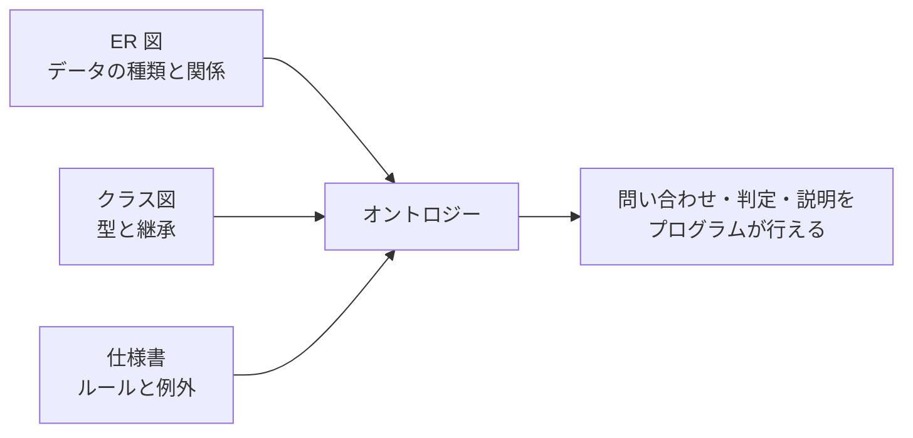

# 第1章 オントロジーとは何か

## 1.1 ひとことで言うと

オントロジーとは、**「ある分野に出てくるモノ・コトの種類と、その間の関係と、そこから言えるルール」を、機械が読める形で書いたもの**です。

たとえば「売買」について、次のようなことを書き出したものがオントロジーです。

- 「売買契約」というコトがある。売主と買主と目的物と代金が登場する
- 売主も買主も「当事者」の一種である
- 売買契約が成立すると、買主は代金を払う義務を負う
- ただし、契約が取り消されたら、その義務はなかったことになる

ここで大事なのは、これが「人間向けの説明文」ではなく、**プログラムが読んで使える形**で書かれていることです。プログラムはこれを読んで、「この取引で買主は代金を払う必要があるか」を判定したり、「取消しに関係するデータはどれか」を探したりできます。

> 「オントロジー」はもともと哲学の言葉（存在論）です。情報科学では 1990 年代から「概念とその関係の明示的な仕様」という意味で使われてきました。本書では哲学の話はしません。

## 1.2 エンジニアがすでに知っているもの

実は、みなさんは似たものをすでに作っています。

| 作っているもの | 書いていること | オントロジーとの関係 |
|---------------|---------------|-------------------|
| ER 図・テーブル定義 | どんなデータがあり、どう関連するか | 「種類」と「関係」は書ける。「ルール」はほとんど書けない |
| Java のクラス図 | どんな型があり、どう継承・保持するか | 「種類」と「継承」は書ける。ルールはメソッドの中に埋もれる |
| 業務マニュアル・仕様書 | ルールや例外 | ルールは書いてあるが、機械は読めない |

オントロジーは、この3つを**1か所にまとめて、機械が読める形にしたもの**だと考えるとわかりやすいでしょう。

## 1.3 テーブル設計との違いを先に知っておく

オントロジーを学ぶとき、RDB の経験はとても役に立ちます。一方で、次の3点は考え方が違うので、最初に意識しておくと混乱しません。

### 違い1: 「保存の都合」ではなく「意味」から考える

テーブル設計では、正規化・検索性能・更新のしやすさを考えて形を決めます。たとえば「顧客」と「取引先」を1つのテーブルにまとめるか分けるかは、使い方次第です。

オントロジーでは、まず「顧客とは何か」「取引先とは何か」「両者はどういう関係か（顧客は取引先の一種か）」という**意味**を決めます。保存の形はその後で考えます。

### 違い2: ルールもデータの一部

RDB では「売上が 100 万円を超えたら優良顧客」というルールは、アプリケーションのコードか、せいぜいビューやストアドプロシージャに書きます。オントロジーでは、このルールも**モデルの一部**として書き、データベースがルールを使って答えを導きます（第4章）。

### 違い3: 「書いていないこと」の扱い

RDB で「優良顧客フラグ」が NULL なら、たいていは「優良顧客ではない」と扱います。オントロジーの世界では、「書いていない」ことが「違う」ことを意味するとは限りません（第5章）。この違いは、ルールで判定するときに重要になります。

## 1.4 Java のクラスとの違いも先に知っておく

Java のクラスもモノの種類を表しますが、次の点が違います。

| 観点 | Java のクラス | オントロジー |
|------|-------------|-------------|
| 目的 | プログラムを動かす | 意味を共有し、問い合わせ・判定する |
| 関係 | フィールドで参照を持つ（`order.customer`）。向きがある | 関係そのものを独立したモノとして扱える（第3章） |
| 分類 | オブジェクトの型は作ったときに決まり、変わらない | 条件を満たせば、あとから「この種類でもある」と判定できる |
| ルール | メソッドの中のコード | 宣言的に書き、データベースや推論エンジンが実行する |
| 共有 | 同じプログラムの中で使う | 部署・会社・システムをまたいで同じ意味で使う |

とくに「分類があとから決まる」点は大きな違いです。Java では `new PremiumCustomer()` と書いた時点で優良顧客ですが、オントロジーでは「売上が 100 万円を超える顧客は優良顧客である」と定義しておけば、条件を満たした顧客が自動的に優良顧客として扱われます。

## 1.5 なぜ今、オントロジーが話題になるのか

オントロジーの考え方は新しいものではありません。2000 年代には「セマンティック Web」として盛んに研究されました。最近また注目されている理由は、主に次の3つです。

1. **データの統合が限界に来ている**: 部署ごと・システムごとに作られたデータベースが増え、「同じ顧客」「同じ製品」をまたいで扱うのが難しくなっています。意味の定義を共有するオントロジーは、統合の土台になります（第6章、第7章）。
2. **ナレッジグラフの普及**: 検索エンジンや EC サイトが、モノとモノの関係を大規模なグラフで管理し、検索や推薦に使うようになりました（第8章）。
3. **生成 AI との組み合わせ**: 大規模言語モデル（LLM）は文章を理解するのは得意ですが、厳密な判定や根拠の提示は苦手です。オントロジーはその弱点を補う「正確な知識の置き場所」として使われ始めています（第4部）。

## 1.6 この本で使う例

本書では、次の例を繰り返し使います。

- **社員・部署・プロジェクト**: 第1部と第3部の例。テーブル設計でおなじみの題材なので、違いがわかりやすい
- **売買と民法**: 第5部で扱う、このリポジトリの題材。ルールと例外が何重にも重なる、オントロジーの力が発揮される分野

## まとめ

- オントロジーは「モノ・コトの種類」「その間の関係」「そこから言えるルール」を、機械が読める形で書いたもの
- ER 図・クラス図・仕様書を1か所にまとめて機械可読にしたもの、と考えるとわかりやすい
- RDB・Java と違うのは、意味から考えること、ルールもモデルに含めること、書いていないことの扱い

| 概念 | RDB | Java | オントロジー |
|------|-----|------|------------|
| 種類 | テーブル | クラス | クラス（概念・型） |
| 個々のもの | 行 | オブジェクト | インスタンス（個体） |
| 性質 | 列 | フィールド | 属性（プロパティ） |
| 関係 | 外部キー・中間テーブル | 参照 | 関係（リレーション） |
| ルール | アプリのコード・ビュー | メソッド | ルール・公理（モデルの一部） |
