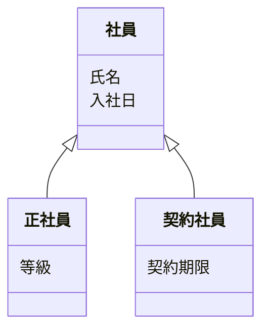

# 第2章 クラス・インスタンス・属性

この章では、オントロジーの一番基本的な部品である「クラス」「インスタンス」「属性」を、テーブルと Java に置き換えながら説明します。

## 2.1 クラスとインスタンス

| オントロジー | RDB | Java | 例 |
|-------------|-----|------|-----|
| クラス | テーブル | クラス | 社員、部署 |
| インスタンス | 行 | オブジェクト | 社員「山田太郎」 |

ここまでは、みなさんの知っている考え方とほぼ同じです。違いが出るのは「1つのものが、複数のクラスに属せるか」です。

- RDB: 1 行は 1 つのテーブルに属します
- Java: 1 つのオブジェクトは 1 つのクラス（とその親クラス）のインスタンスです
- オントロジー: 1 つのインスタンスが、**互いに親子関係のない複数のクラスに同時に属して**かまいません

たとえば山田さんが「社員」であり、同時に「株主」であり、「顧客」でもある、ということは現実によくあります。Java では、`Employee` と `Shareholder` と `Customer` を全部継承したクラスを作るわけにはいかないので、役割ごとに別のオブジェクトを作って関連づけるのが普通です。オントロジーでは、山田さんという1つのインスタンスに3つのクラスを付ければ済みます（データベースによっては制限があります。第3部で扱います）。

## 2.2 継承（is-a）

「正社員は社員の一種である」「契約社員も社員の一種である」という関係を、**サブクラス関係**（is-a 関係）と呼びます。



Java の継承とほぼ同じですが、意味は少し違います。

- Java の継承は「実装（フィールドやメソッド）を引き継ぐ」仕組みでもあります
- オントロジーのサブクラスは「**正社員であれば、必ず社員でもある**」という論理的な主張です。実装の再利用ではありません

この違いから、オントロジーでは「正社員を全員探して」と頼まなくても、「社員を全員探して」と頼めば正社員も契約社員も返ってきます。データベースがサブクラス関係を知っていて、自動的に含めてくれるからです。

### RDB で継承を表すときの苦労

RDB には継承の仕組みがないので、次の3つの方法から選ぶことになります（第15章で詳しく扱います）。

| 方法 | テーブル | 弱点 |
|------|---------|------|
| 1 テーブルにまとめる | `employee`（全員分の列を持ち、種別列で区別） | 使わない列が NULL だらけになる |
| 子クラスごとに分ける | `regular_employee`, `contract_employee` | 「社員全員」を探すのに UNION が要る |
| 親と子を分けて結合 | `employee` + `regular_employee` + … | 結合が増える |

どの方法でも、「正社員は社員である」という**意味**はテーブル定義からは読み取れず、アプリケーションのコードや設計書に書くしかありません。オントロジーでは、これをモデルそのものに書きます。

## 2.3 属性

属性は、インスタンスが持つ値（氏名、入社日、金額など）です。RDB の列、Java のフィールドに当たります。

オントロジーで属性を扱うときの特徴は2つあります。

### 特徴1: 属性は独立して定義し、複数のクラスで共有できる

RDB では、列は必ずどこかのテーブルに属します。`employee.name` と `department.name` は別々の列です。

オントロジーでは、「名前」という属性を1つ定義しておき、社員にも部署にも持たせることができます。こうしておくと「名前が『営業』を含むもの」を、社員・部署を問わず一度に探せます。

```
属性「名前」（文字列）
社員 は 名前 を持つ
部署 は 名前 を持つ
```

### 特徴2: 値が複数あってもよい

RDB の列は、1 行に 1 つの値しか入りません（複数入れたいなら子テーブルを作ります）。オントロジーでは、ある社員が「資格」を3つ持っていれば、そのまま3つの値を持たせます。何個まで許すか（多重度）は制約として書きます。

| 書き方の例 | 意味 |
|-----------|------|
| 社員 は 社員番号 をちょうど1つ持つ | 必須で1つ（RDB の NOT NULL + 主キー相当） |
| 社員 は 資格 を0個以上持つ | 任意で複数可（RDB なら子テーブル） |

> このリポジトリでは、規範（法律のルール）が典拠を複数持てるように、TypeDB で `owns authority-ref @card(0..)` と書いています。TypeDB では何も書かないと「0個か1個」になるので、複数持たせたいときは明示します（第24章）。

## 2.4 型と制約

オントロジーでは、属性の値の型（文字列、数値、日付、真偽値）や、取りうる値の範囲を制約として書きます。

```
属性「雇用区分」は 文字列 で、値は「正社員」「契約社員」「派遣」のどれか
```

RDB の CHECK 制約や Java の enum と同じ役割です。違いは、制約もモデルの一部として他のシステムと共有できることです。

## 2.5 よくある疑問

**Q. 「部署」はクラスか、インスタンスか？**
「部署」という種類はクラスで、「営業部」は部署クラスのインスタンスです。ただし、分野によっては「営業部」をさらに細かく分類したくなることがあります（たとえば「営業部」というクラスの下に「東京営業部」「大阪営業部」）。何をクラスにして何をインスタンスにするかに唯一の正解はなく、「何を問い合わせたいか」で決めます。迷ったら、**個別に名前を付けて数えるものはインスタンス、分類に使うものはクラス**と考えるのが目安です。

**Q. 属性と関係の境目は？**
値が「文字列・数値・日付」なら属性、相手が「別のモノ（インスタンス）」なら関係（第3章）です。「所属部署」は部署というモノを指すので関係、「部署名」は文字列なので属性です。

## まとめ

- クラス・インスタンス・属性は、テーブル・行・列、クラス・オブジェクト・フィールドに対応する
- 1 つのインスタンスが複数のクラスに属せる
- サブクラスは「AならばBでもある」という論理的な主張で、問い合わせのときに自動で使われる
- 属性はクラスから独立して定義でき、複数の値を持てる

| 概念 | RDB | Java | オントロジー |
|------|-----|------|------------|
| 継承 | 3 通りの表し方から選ぶ。意味は設計書に書く | `extends`。実装も引き継ぐ | サブクラス関係。意味そのものとして書く |
| 複数の分類 | 別テーブル＋結合 | インタフェースや委譲で工夫 | 1 つのインスタンスに複数のクラス |
| 属性の共有 | できない（テーブルごとの列） | インタフェースで共通化 | 属性を独立して定義し共有 |
| 複数値 | 子テーブル | `List<T>` | 多重度の制約つきで複数値 |
