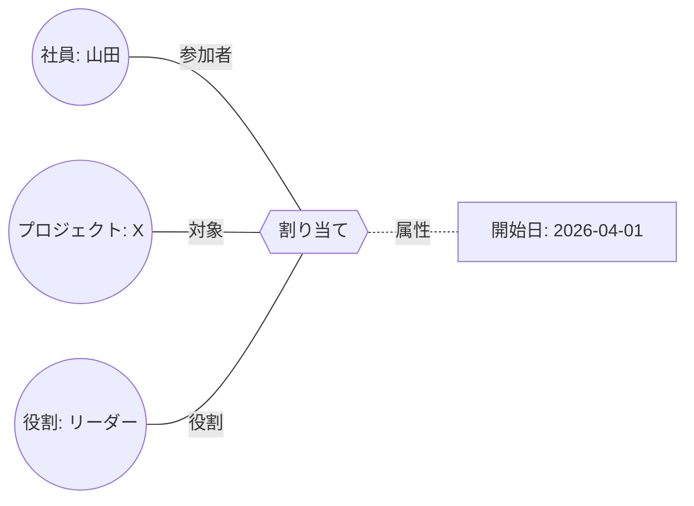

# 第3章 関係を主役にする

オントロジーの考え方で、テーブル設計と一番違うのが「関係」の扱いです。この章では、外部キーや Java の参照ではうまく書けない関係を、オントロジーではどう書くかを見ていきます。

## 3.1 外部キーと参照の限界

社員が部署に所属する、という関係を考えます。

```sql
CREATE TABLE employee (
  id      INT PRIMARY KEY,
  name    VARCHAR(100),
  dept_id INT REFERENCES department(id)   -- 所属
);
```

```java
class Employee {
    String name;
    Department department;   // 所属
}
```

1 対多の単純な関係なら、これで十分です。しかし、現実の関係はすぐに複雑になります。

- 所属に「いつから」「兼務か本務か」という情報を付けたい
- 1 人が複数の部署に所属する（兼務）
- 「社員が、プロジェクトに、ある役割で、ある期間参加する」という、3 つ以上のものが関わる関係

RDB では中間テーブルを作り、Java では関係を表すクラス（`Assignment` など）を作って対応します。これは実は、**関係を独立したモノとして扱う**ことに他なりません。オントロジーでは、これを最初から当たり前のこととして扱います。

## 3.2 関係は独立したモノ

オントロジーでは、「所属」「割り当て」「契約」といった関係を、クラスと同じように名前のある独立した概念として定義します。



ここで「割り当て」は、社員・プロジェクト・役割の 3 つをつなぐ1つの関係で、開始日という属性を持っています。

| やりたいこと | RDB | Java | オントロジー |
|------------|-----|------|------------|
| 関係に属性を付ける | 中間テーブルに列を足す | 関係クラスにフィールドを足す | 関係に属性を持たせる |
| 3 者以上の関係 | 外部キーを 3 つ持つ中間テーブル | 3 つの参照を持つクラス | n 項関係として定義 |
| 関係の種類の継承 | できない | 関係クラスを継承 | 関係のサブタイプを定義 |

## 3.3 ロール（役割）

関係の中で、それぞれの参加者が果たす役割を**ロール**と呼びます。

「売買」という関係には「売主」と「買主」というロールがあります。どちらも「当事者」ですが、立場が違います。

```
関係「売買契約」
  ロール「売主」: 当事者 が担う
  ロール「買主」: 当事者 が担う
  ロール「目的物」: 財産 が担う
```

RDB でいうと、`seller_id` と `buyer_id` という 2 つの外部キーが同じ `party` テーブルを指している状態です。違いは、オントロジーでは「売主」「買主」が名前のあるロールとして定義されているので、

- 「この人が売主として関わっている契約」と「買主として関わっている契約」を区別して探せる
- 「立場を問わず、この人が関わっている契約」も一度に探せる

という問い合わせが、どちらも自然に書けることです。

> 第5部で扱うこのリポジトリでは、法律の規範が「請求する側」「請求される側」というロールで書かれています。誰が売主で誰が買主かに関係なく、「請求している側に証明責任がある」といったルールを書くためです。

## 3.4 二項関係しか書けない方式もある

関係の扱いは、オントロジーを保存するデータベースの方式によって違います（第3部）。

- **RDF（第11章）**: 基本は「主語・述語・目的語」の二項関係だけです。3 者以上の関係は、関係を表すノードを1つ作り、そこから各参加者へ線を引いて表します（RDB の中間テーブルと同じ発想です）
- **プロパティグラフ（第12章）**: 線（エッジ）に属性を付けられますが、線は2点を結ぶだけなので、3 者以上の関係は同じくノードを作って表します
- **TypeDB（第13章）**: 関係を最初から n 項・ロールつきで定義できます

どの方式でも「関係を独立したモノとして扱う」という考え方は同じで、書きやすさが違うだけです。

## 3.5 関係の性質

関係そのものに、論理的な性質を持たせることもできます。推論（第4章）で使われます。

| 性質 | 意味 | 例 |
|------|------|-----|
| 推移的 | AがBと、BがCと関係があれば、AはCとも関係がある | 「部品である」: ネジはエンジンの部品、エンジンは車の部品 → ネジは車の部品 |
| 対称的 | AがBと関係があれば、BもAと関係がある | 「同僚である」 |
| 逆関係 | 一方向の関係に、逆向きの名前を付ける | 「上司である」⇔「部下である」 |

RDB では、これらの性質はクエリを書く人が毎回意識する必要があります（推移的な関係を全部たどるには、再帰 CTE を書きます）。オントロジーでは性質をモデルに書いておけば、問い合わせる人は意識しなくて済みます。

## 3.6 設計のヒント

- **動詞が出てきたら関係を疑う**: 「参加する」「契約する」「承認する」は関係の候補です
- **「いつ」「どの立場で」を聞かれたら、関係に属性やロールを付ける**: 外部キー 1 本で済ませると、あとで中間テーブルへの作り直しが必要になります
- **関係にも名前と定義を書く**: 「関連」「紐づけ」のようなあいまいな名前は避けます。「割り当て」「所属」「担当」は意味が違うはずです

## まとめ

- オントロジーでは、関係を独立した概念として名前を付けて定義する
- 関係は属性を持て、3 者以上を結べ、参加者ごとにロールを持つ
- 推移的・対称的といった関係の性質を書いておけば、問い合わせのときに自動で使われる

| 概念 | RDB | Java | オントロジー |
|------|-----|------|------------|
| 1 対多の関係 | 外部キー | 参照フィールド | 関係（二項） |
| 関係の属性 | 中間テーブルの列 | 関係クラスのフィールド | 関係の属性 |
| 3 者以上の関係 | 中間テーブル | 関係クラス | n 項関係 |
| 参加者の立場 | 外部キーの列名 | フィールド名 | ロール |
| 推移的な関係 | 再帰 CTE を毎回書く | 再帰メソッドを書く | 関係の性質として宣言 |
