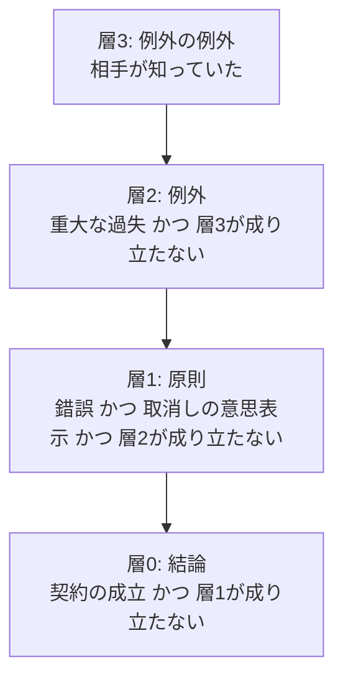

# 第5章 「わからない」をどう扱うか

データに書いていないことを「違う」とみなすか、「わからない」とみなすか。この違いは、ルールで判定するシステムの結論を大きく左右します。この章は少し抽象的ですが、第5部の法律の例を理解する鍵になります。

## 5.1 2 つの考え方

| 考え方 | 書いていないことは | 例 |
|--------|----------------|-----|
| 閉世界仮定（Closed World Assumption） | 偽（違う）とみなす | RDB、多くの業務システム |
| 開世界仮定（Open World Assumption） | 不明とみなす | OWL（第11章）、Web 上の知識 |

具体例で考えます。社員テーブルに山田さんの「資格」の行がないとき、

- 閉世界: 山田さんは資格を持っていない
- 開世界: 山田さんが資格を持っているかどうかは、わからない

どちらが正しいかは、データの性質によります。

- **社内の人事システム**: 資格は申請しないと登録されない運用なら、「登録がない = 持っていない」と考えてよいでしょう。閉世界が向いています
- **Web から集めた企業情報**: ある会社の子会社がデータにないのは、単に集めきれていないだけかもしれません。開世界が向いています

## 5.2 RDB の NULL と NOT EXISTS

RDB は基本的に閉世界ですが、NULL という「わからない」を表す仕組みがあります。

```sql
-- 資格を持たない社員
SELECT * FROM employee e
WHERE NOT EXISTS (SELECT 1 FROM qualification q WHERE q.employee_id = e.id);
```

この SQL は「登録がない = 持っていない」と考えています（閉世界）。一方で、`qualification_checked` 列が NULL なら「まだ確認していない」と扱う、といった運用で「わからない」を表すこともあります。

RDB の三値論理（TRUE / FALSE / UNKNOWN）は、NULL との比較が UNKNOWN になる、という形で「わからない」を扱いますが、`WHERE` 句では UNKNOWN が FALSE と同じに扱われるため、うっかりすると閉世界と同じ動きになります。

## 5.3 「わからない」を明示的に持つ

ルールで判定するシステムでは、「わからない」を NULL や「行がない」に頼らず、**明示的な状態として持つ**のが安全です。

このリポジトリでは、事実ごとに証明状態を4つの値で持っています。

| 証明状態 | 意味 |
|---------|------|
| 自白（admitted） | 相手も認めている |
| 証明済（proven） | 証拠で証明された |
| 真偽不明（unclear） | 証明しようとしたが、どちらとも言えない |
| 否定（disproven） | そうではないと証明された |
| （入力なし） | まだ主張されていない |

「真偽不明」と「否定」と「入力なし」は、どれも「その事実が成り立つとは言えない」点では同じです。しかし、報告では区別して表示します。「真偽不明」なら、もっと証拠を集めれば結論が変わる可能性がある、と利用者に伝えられるからです（第26章）。

## 5.4 否定を含むルールの難しさ

業務ルールには「〜でなければ」がよく出てきます。

- 「延滞がなければ、与信枠を引き上げる」
- 「取り消されていなければ、代金を払う義務がある」

このようなルールは、**閉世界の考え方**（成り立つと言えなければ、成り立たないとみなす）で評価します。論理プログラミングではこれを「失敗による否定（negation as failure）」と呼びます。

ここで問題になるのが、否定が入れ子になったり、循環したりする場合です。

```
ルール1: 取消しが成り立たなければ、代金の請求が成り立つ
ルール2: 重大な過失がなければ、取消しが成り立つ
ルール3: 相手が知っていれば、（重大な過失があっても）取消しが成り立つ
```

原則 → 例外 → 例外の例外、という構造です。これ自体は問題ありませんが、もし「ルール2の結論がルール1の条件に使われ、ルール1の結論がルール2の条件に使われる」という循環があると、答えが決まりません。

## 5.5 層化否定: 否定を安全に使う方法

この問題を避ける考え方が**層化否定（stratified negation）**です。ルールを層に分け、**否定の中では、自分より下の層（先に計算が終わる層）のものしか使わない**ようにします。



下（層3）から順に計算すれば、上の層を計算するときには、否定の中で使うものの答えがすでに確定しています。だから結果が一つに決まります。

この構造は、法律の「原則 → 例外 → 例外の例外」や、民事訴訟の「請求原因 → 抗弁 → 再抗弁」とぴったり対応します。このリポジトリが TypeDB の関数（層化否定に対応）を選んだ理由の一つです（第25章）。

## 5.6 証明責任と「わからない」

法律の世界には、「わからない」ときにどちらに不利に扱うかを決めるルールがあります。**証明責任**です。

> ある事実が真偽不明なら、その事実を証明する責任を負う側の不利益に扱う

たとえば、買主が「売主は私の勘違いを知っていた」ことを証明する責任を負う場合、それが真偽不明なら「知らなかった」として扱われます。これは、5.4 の「成り立つと言えなければ、成り立たないとみなす」とまったく同じ考え方です。

つまり、層化否定で書いたルールは、証明責任の考え方を自然に表せます。この対応が、法律をオントロジーで扱う上での大きな手がかりになっています。

## 5.7 設計のヒント

- **データごとに、閉世界で扱ってよいかを決めて書いておく**: 「登録がない = ない」と言えるデータか、収集が不完全なデータか
- **「わからない」を表す状態を明示的に持つ**: NULL や行の有無に意味を持たせすぎない
- **否定を含むルールは、層に分けて循環を禁止する**: ツールが自動で検査できるようにする（このリポジトリでは規範の読み込み時に検査しています）

## まとめ

- 書いていないことを「違う」とみなすのが閉世界、「わからない」とみなすのが開世界
- RDB は基本的に閉世界。オントロジーの標準（OWL）は開世界。目的に応じて使い分ける
- 否定を含むルールは、層に分けて「否定の中では下の層だけを使う」ようにすれば、結果が一つに決まる（層化否定）
- 法律の証明責任は、閉世界の否定と同じ考え方で表せる

| 概念 | RDB | Java | オントロジー |
|------|-----|------|------------|
| 不明 | NULL（三値論理） | `null`、`Optional.empty()` | 開世界仮定、または明示的な状態 |
| 否定 | `NOT EXISTS` | `!` | 失敗による否定（閉世界） |
| 否定の安全な使い方 | （特になし） | （特になし） | 層化否定 |
