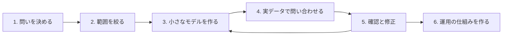

# 第9章 導入の進め方とつまずきやすい点

オントロジーの導入は、技術よりも進め方でつまずくことが多いプロジェクトです。この章では、小さく始めて育てる進め方と、よくある失敗を紹介します。

## 9.1 進め方の全体像

### ステップ1: 問いを決める

最初に決めるのは、モデルではなく**答えたい問い**です。

- 悪い例: 「全社の業務知識をオントロジーにする」
- よい例: 「この部品のロットを使った出荷済み製品と、その納入先を 10 分以内に特定したい」

問いを 10〜20 個書き出し、それぞれ「今はどうやって答えているか」「どれくらい時間がかかるか」を記録します。これが効果測定の基準になります（第7章）。

このリポジトリでは、最初に「この事実関係で請求は認められるか」「結論を変えるには誰が何を立証すればよいか」「その根拠条文は何か」「条文が改正されたらどの結論が変わるか」という問いを決めてから設計を始めました（第22章）。

### ステップ2: 範囲を絞る

問いに答えるのに必要な概念だけを対象にします。目安は、**概念（クラス・関係）が数十個、ルールが数十個**です。

このリポジトリでは、民法全体ではなく、意思表示・売買・消滅時効に絞り、規範（ルール）を 29 件から始めました。

### ステップ3: 小さなモデルを作る

- 概念の名前と定義を書く（定義が書けない概念は、まだ理解が足りない証拠）
- 関係とロールを決める（第3章）
- ルールを書く（第4章）
- 既存の標準語彙で使えるものがないか調べる（第6章）

### ステップ4: 実データで問い合わせる

モデルの良し悪しは、実データで問い合わせてみるまでわかりません。テスト用のデータを作り、ステップ1の問いがクエリとして書けるか、期待どおりの答えが返るかを確かめます。**期待する答えを先に書いておき、自動テストにする**と、モデルを変更したときに壊れていないかを確認できます。

### ステップ5: 確認と修正

モデルを、その分野をよく知る人（業務担当者・専門家）に確認してもらいます。技術者だけで作ったモデルは、言葉の使い方や例外の扱いがずれていることがよくあります。

### ステップ6: 運用の仕組みを作る

- 誰がモデルを変更できるか、誰が確認するか
- 変更の履歴をどう残すか（ファイルにして Git で管理するのが手軽です）
- ルールが変わったとき（法改正、社内規程の改定）に、どう反映するか

## 9.2 役割分担

| 役割 | 担うこと | 必要な知識 |
|------|---------|-----------|
| 業務・分野の専門家 | 概念の定義、ルールの正しさの確認 | 業務知識。技術は不要 |
| モデラー | 概念・関係・ルールを形式的に書く | 業務を聞き取る力と、モデリングの技術 |
| エンジニア | データの取り込み、データベース、アプリケーション | データベース、プログラミング |
| データ管理者 | 定義と ID の管理、変更の承認 | 組織横断の調整 |

小さなプロジェクトでは、モデラーとエンジニアは同じ人が兼ねることが多いでしょう。本書の読者のような、RDB と Java がわかるエンジニアは、モデラーを担う素地があります。

**専門家を確保できない場合**: このリポジトリはまさにこの状況です。そのときは、「専門家が確認済み」という前提でシステムを作らないことが大切です。ルールごとに典拠（根拠となる資料）を記録し、確認の状態（未確認・確認済み・疑義あり）を持たせ、出力のたびに未確認のルールを使ったことを表示します（第21章、第24章）。

## 9.3 つまずきやすい点

### 失敗1: 作りすぎる

最初から全社・全業務の概念を網羅しようとして、何年もかけてモデルを作り、結局使われない。いちばん多い失敗です。

**対策**: 問いから始め、問いに答えるのに必要な分だけ作る。使われてから広げる。

### 失敗2: 抽象化しすぎる

「すべてはモノである」「モノには性質がある」のような抽象的な概念から作り始め、業務の人が読めないモデルになる。

**対策**: 業務の言葉で、具体的な概念から作る。抽象的な上位概念は、共通点が見えてから導入する。

### 失敗3: 技術から入る

「グラフデータベースを導入する」こと自体が目的になり、何に使うかが決まっていない。

**対策**: ツールの選定は、問いとデータが決まってから（第16章）。最初の検証は、手元の RDB や小さなファイルでもできる。

### 失敗4: 保守されない

導入時は熱心にモデルを作ったが、業務やルールが変わってもモデルが更新されず、現実とずれていく。

**対策**: モデルの変更を業務の手順に組み込む（規程の改定手順に「オントロジーの更新」を入れる）。モデルの変更を自動テストで検証する。

### 失敗5: 推論に期待しすぎる

「オントロジーを作れば、AI のように何でも推論してくれる」と期待する。実際の推論は、書いたルールの範囲でしか働きません。

**対策**: 推論は「書いたルールを正確に、漏れなく当てはめる」ものだと理解する。あいまいな判断は人や LLM に任せ、オントロジーは正確さが必要な部分を担う（第17章）。

### 失敗6: データ品質を見落とす

モデルは立派でも、取り込むデータの名寄せができておらず、問い合わせの答えが信用できない。

**対策**: 取り込みの段階で検証を入れる（このリポジトリでは、取り込んだ条文を元データと無作為抽出で突き合わせています。第23章）。

## 9.4 最初の 3 か月の計画例

| 期間 | やること | 成果物 |
|------|---------|-------|
| 1〜2 週 | 問いの洗い出し、範囲の決定 | 問いの一覧（10〜20 件）、現状の所要時間 |
| 3〜6 週 | 小さなモデルとテストデータ | 概念・関係・ルールの定義、期待する答えつきのテスト |
| 7〜10 週 | 実データの取り込みと問い合わせ | 取り込みスクリプト、問いに答えるクエリ |
| 11〜12 週 | 専門家の確認、効果の測定 | 確認結果、所要時間の比較、次の範囲の提案 |

## まとめ

- 答えたい問いから始め、範囲を絞り、小さなモデルを実データで試して育てる
- 専門家の確認が欠かせない。確保できない場合は、典拠と確認状態を記録して出力に表示する
- 作りすぎ・抽象化しすぎ・技術先行・保守されない・推論への過度な期待・データ品質の軽視が典型的な失敗
