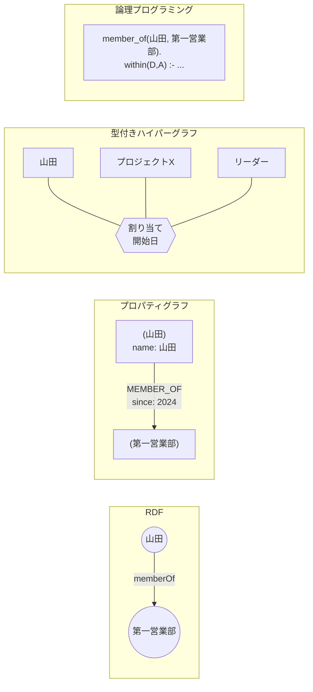
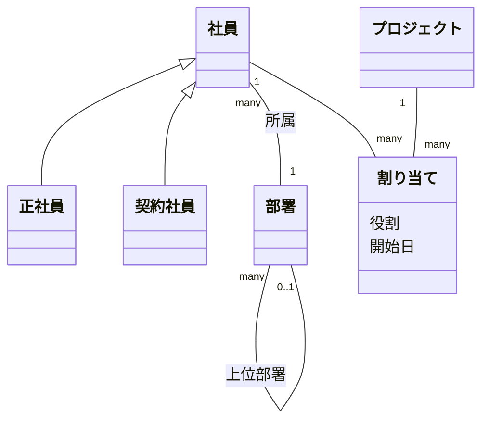

# 第10章 パラダイムの全体像

オントロジーをデータベースに保存して使う方法は、1 つではありません。この部では、考え方（パラダイム）の違う 5 つの方式を、同じ例題で書き比べます。

## 10.1 5 つの方式

| 方式 | データの基本単位 | 代表的な製品・標準 | 章 |
|------|---------------|-----------------|----|
| RDF（トリプル） | 主語・述語・目的語の三つ組 | RDF、OWL、SPARQL、SHACL／GraphDB、Stardog、Apache Jena、Amazon Neptune など | 11 |
| プロパティグラフ | 属性を持つノードとエッジ | Neo4j、Cypher、ISO GQL／Amazon Neptune、Memgraph など | 12 |
| 型付きハイパーグラフ | エンティティ・リレーション・属性 | TypeDB、TypeQL | 13 |
| 論理プログラミング | 事実とルール | Datalog（Soufflé など）、Prolog、ASP（clingo など） | 14 |
| リレーショナル | テーブルの行 | PostgreSQL などの RDB、SQL（再帰 CTE、SQL/PGQ） | 15 |

それぞれ、何を「一番の基本」と考えるかが違います。

- **RDF** は「線 1 本が 1 つの事実」。すべてを三つ組に分解する
- **プロパティグラフ** は「点と線に属性を付けたもの」。線をたどる処理に強い
- **型付きハイパーグラフ** は「3 者以上をまとめて結ぶ関係」を基本単位にする
- **論理プログラミング** は「事実とルールの集まり」。推論そのものが主役
- **リレーショナル** は「表の行」。意味はアプリケーションと設計書が持つ

## 10.2 例題

各章では、次の例題を同じように表し、同じ 3 つの問いに答えます。

### データ

- 社員: 山田（正社員）、佐藤（契約社員）、鈴木（正社員）、田中（正社員）
- 部署の階層: 第一営業部 → 営業本部、第二営業部 → 営業本部、開発部（独立）
- 所属: 山田・佐藤 → 第一営業部、鈴木 → 第二営業部、田中 → 開発部
- プロジェクトへの割り当て（社員・プロジェクト・役割・開始日の 4 つを結ぶ関係）
  - 山田: プロジェクト X、リーダー、2026-04-01
  - 佐藤: プロジェクト X、メンバー、2026-04-15
  - 鈴木: プロジェクト Y、リーダー、2026-05-01

### モデル（概念）

### 問い

| 問い | 内容 | 試される力 |
|-----|------|----------|
| Q1 | 営業本部（配下の部署を含む）に所属する社員は誰か | 継承（社員 = 正社員 + 契約社員）と、推移的な関係（部署の階層） |
| Q2 | 各プロジェクトのリーダーは、誰の作業を承認できるか（ルール: リーダーは同じプロジェクトの他のメンバーを承認できる） | 3 者以上の関係（割り当て）とルール |
| Q3 | どのプロジェクトにも割り当てられていない社員は誰か | 否定（閉世界） |

### 期待する答え

| 問い | 答え |
|-----|------|
| Q1 | 山田、佐藤、鈴木 |
| Q2 | 山田 → 佐藤（鈴木はプロジェクト Y の唯一のメンバーなので、承認対象なし） |
| Q3 | 田中 |

## 10.3 比べる観点

各章の最後で、次の観点を表にまとめます。第16章で全体を比較します。

| 観点 | 問うこと |
|------|---------|
| スキーマ | 概念と制約をどこまで書けるか、書かなくても動くか |
| 継承 | 親クラスで問い合わせたとき、子クラスが自動で含まれるか |
| n 項関係 | 3 者以上の関係と、関係の属性を自然に書けるか |
| 推移的な関係 | 階層を何段でもたどれるか |
| ルール | 推論のルールをデータベースの中に書けるか |
| 否定 | 「〜でない」をどう扱うか（開世界か閉世界か） |
| 標準化 | 仕様が標準化され、製品を選べるか |

## まとめ

- オントロジーを保存する方式には、RDF、プロパティグラフ、型付きハイパーグラフ、論理プログラミング、リレーショナルの 5 つがある
- 基本単位（三つ組、点と線、n 項関係、事実とルール、表の行）が違い、それが得意・不得意の差になる
- 次章から、同じ例題と 3 つの問いで書き比べる
