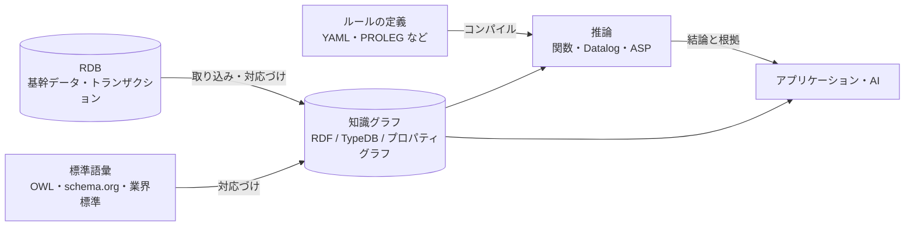

# 第16章 比較と選び方

第11章から第15章で見た 5 つの方式を比べ、目的に応じた選び方を整理します。

## 16.1 比較表

| 観点 | RDF / OWL | プロパティグラフ | TypeDB | 論理プログラミング | RDB |
|------|----------|---------------|--------|----------------|-----|
| 基本単位 | 三つ組 | 点と線 | エンティティ・関係・属性 | 事実とルール | 表の行 |
| スキーマ | 任意（OWL・SHACL で追加） | 任意（制約は一部） | 必須・厳密 | 弱い | 必須 |
| 継承 | ○（subClassOf、推論） | △（ラベルを重ねる） | ◎（全種類の型） | ○（ルールで書く） | △（3 通りの表し方） |
| n 項関係・関係の属性 | △（関係をノードに） | ○（線の属性）／△（3 者以上） | ◎ | ◎ | ○（中間テーブル） |
| 推移的な関係 | ◎（プロパティパス、推論） | ◎（可変長パス、高速） | ○（再帰関数） | ◎（再帰ルール） | ○（再帰 CTE） |
| ルール・推論 | ○（OWL の分類。業務ルールは製品依存） | △（アプリで実行） | ○（関数、層化否定） | ◎ | △（ビュー） |
| 否定・例外 | △（OWL は開世界） | ○（閉世界） | ○（閉世界、層化） | ◎（層化、ASP） | ○（閉世界） |
| 外部データとの接続 | ◎（URI、公開データ、標準語彙） | △ | △ | △ | △ |
| 標準化 | ◎（W3C） | ○（ISO GQL） | ×（独自） | ○（ISO Prolog）／処理系ごと | ◎（SQL） |
| 人材・情報の多さ | ○ | ○ | △ | △ | ◎ |
| トランザクション・大量更新 | ○ | ○ | ○ | × | ◎ |

◎ とても得意、○ 得意、△ 工夫が要る、× 不得意（本書の評価で、製品によって差があります）

## 16.2 目的別の選び方

| 目的 | 第一候補 | 理由 |
|------|---------|------|
| 組織・業界をまたいだデータ統合、公開データとの連携 | RDF / OWL | URI と標準語彙で外部とつながる。仕様が標準化されている |
| つながりの探索（不正検知、推薦、依存関係、ネットワーク） | プロパティグラフ | 経路探索が速く、グラフアルゴリズムが充実 |
| 複雑な関係と型を厳密に持ち、ルールで判定する | TypeDB | n 項関係・継承・型検査・関数がそろっている |
| 原則と例外が何重にも重なるルールの推論 | 論理プログラミング（＋保存用のデータベース） | 推論そのものが主役で、理論が明確 |
| 既存システムの上に意味を足す、トランザクションが中心 | RDB（＋意味の定義、SQL/PGQ、仮想ナレッジグラフ） | 既存資産を生かせる |

## 16.3 組み合わせて使う

実際のシステムでは、1 つの方式で全部をまかなうより、役割を分けて組み合わせることが多いです。

- **基幹データ**は RDB に残す
- **意味の層**（共通の概念・ID・関係）は知識グラフに置く
- **ルール**は人が読める形で別に書き、推論エンジンの形式に変換する
- **推論の結果と根拠**をアプリケーションや AI に返す

このリポジトリは、法令データ（e-Gov の XML）を取り込み、ルールを YAML で書いて TypeDB の関数に変換し、推論の結果と根拠を報告する、という形でこの構成を小さく実装しています（第22章）。提案書では、層化否定で扱えないルールの衝突が出てきたら ASP などの外部エンジンを足す計画です。

## 16.4 選ぶときのチェックリスト

- [ ] 答えたい問い（第9章）を、候補の方式でクエリとして書いてみたか
- [ ] 3 者以上の関係、関係の属性がどれくらいあるか
- [ ] ルールに否定・例外がどれくらいあるか。ルール同士の衝突はあるか
- [ ] 外部データや業界標準とつなぐ必要があるか
- [ ] データ量、更新頻度、応答時間の要件は
- [ ] 運用できる人がいるか、情報が手に入るか
- [ ] 小さなデータで、実際の製品を動かして試したか（このリポジトリでは、提案書の TypeQL を最初に実機で検証し、ドキュメントからはわからない制約をいくつも見つけました）

## まとめ

- 外部とつなぐなら RDF/OWL、つながりの探索ならプロパティグラフ、複雑な関係と型とルールなら TypeDB、例外の多い推論なら論理プログラミング、既存資産と取引処理なら RDB
- 実際には、基幹データ・意味の層・ルール・推論を分けて、方式を組み合わせる
- 選ぶ前に、自分の問いをクエリとして書き、実際の製品で試す
