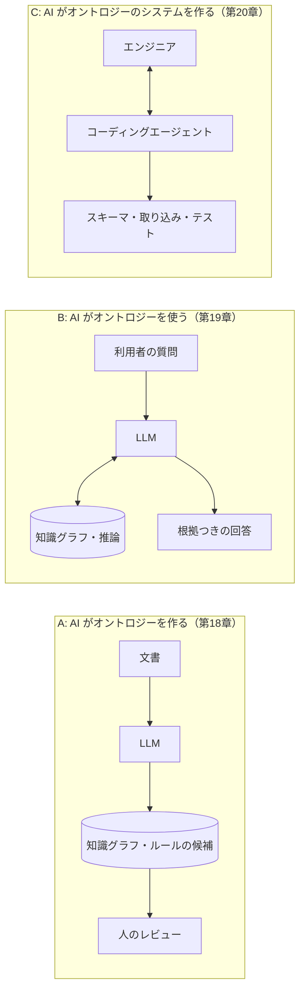

# 第17章 LLM とオントロジーの役割分担

大規模言語モデル（LLM）とオントロジーは、得意なことがほぼ正反対です。だからこそ、組み合わせると互いの弱点を補えます。この章では、両者の役割分担の考え方を整理します。

## 17.1 得意・不得意を並べる

| 観点 | LLM | オントロジー（知識グラフ＋ルール） |
|------|-----|-------------------------------|
| 入力 | 自然な文章、あいまいな表現、表記ゆれ | 決められた形式のデータ |
| 知識の範囲 | 広い（学習した範囲全般） | 狭い（作った範囲だけ） |
| 正確さ | もっともらしいが、誤りが混じることがある | 書いたとおりに正確 |
| 一貫性 | 同じ問いに違う答えを返すことがある | 同じ入力には必ず同じ答え |
| 根拠 | 根拠を示しにくい（示しても後づけのことがある） | どのルールのどの条件で導いたかを示せる |
| 更新 | 再学習や文脈への追加が必要 | データやルールを直せばすぐ反映 |
| 作るコスト | すぐ使える | 作るのに手間がかかる |

LLM は**広く・柔軟だが、厳密さと根拠に弱い**。オントロジーは**狭く・硬いが、厳密で根拠を示せる**。

## 17.2 組み合わせの 3 つの型

| 型 | LLM の役割 | オントロジーの役割 |
|----|-----------|-----------------|
| A: 構築支援 | 文書から概念・関係・ルールの候補を抽出する | 抽出結果を受け止める器。形式の検査をする |
| B: 利用 | 質問を理解し、問い合わせに変換し、結果を文章にする | 正確な事実と推論を提供する |
| C: 開発支援 | スキーマ・コード・テストを書き、動かして直す | 作る対象 |

## 17.3 役割分担の原則

### 原則1: 判定はオントロジー、言葉は LLM

「請求が認められるか」「この顧客は与信枠を引き上げてよいか」のような、**正確さと根拠が求められる判定**は、オントロジーのルールで行います。LLM は、利用者の話から事実を拾い出す（「先月買った絵が偽物だった」→「動機の錯誤」の候補）、判定結果をわかりやすい文章にする、といった**言葉の部分**を担います。

### 原則2: LLM の出力は「候補」として扱う

LLM が抽出した事実やルールは、そのまま確定させず、**候補**として扱います。オントロジーの側で形式を検査し（型が合うか、参照先があるか、循環がないか）、人が採否を決めます。

### 原則3: 根拠はオントロジーから取る

LLM に回答の根拠を書かせると、もっともらしいが存在しない根拠を書くことがあります。根拠（条文、規程、データの出どころ）は、オントロジーの推論結果から機械的に取り出して添えます。

## 17.4 法律を例にした役割分担

このリポジトリの題材で考えると、次のような分担になります。

| 作業 | 担当 | 理由 |
|------|------|------|
| 相談内容の文章から、要件事実の候補を拾う | LLM | 自然な文章の理解が必要 |
| 拾った事実を、規範の要件（fact-code）に対応づける | LLM が候補を出し、人が確認 | 対応づけを誤ると結論が変わる |
| 事実の証明状態（証明済・真偽不明など）を決める | 人 | 証拠の評価は人の判断 |
| 「重大な過失」などの評価 | 人 | 規範的な評価は人の判断 |
| 請求が認められるかの判定 | オントロジー（規範層と推論層） | 正確さと一貫性 |
| 不足している事実と証明責任の列挙 | オントロジー | 漏れなく機械的に |
| 根拠条文の提示 | オントロジー（条文層） | 存在する条文だけを示す |
| 結果を相談者向けの文章にする | LLM | 言葉の部分 |
| 条文から規範（ルール）の候補を作る | LLM が候補を出し、人が確認 | 作成の手間を減らす |

## 17.5 よくある誤解

**「LLM が賢くなれば、オントロジーは要らなくなるのでは？」**
LLM がどれだけ賢くなっても、「組織として決めたルールを、決めたとおりに、説明できる形で適用する」ことの価値は残ります。業務のルールは組織が決めるもので、LLM が学習で知っているものではないからです。また、監査や規制の場面では「なぜそう判断したか」を後から検証できることが求められます。

**「オントロジーを作るのが大変なら、LLM に全部作らせればよいのでは？」**
候補を作らせるのは有効です（第18章）。しかし、確認せずに確定させると、もっともらしい誤りがルールとして固定され、以後すべての判定に影響します。誰が確認したかを記録する仕組みが必要です（第21章）。

## まとめ

- LLM は広く柔軟だが厳密さと根拠に弱く、オントロジーは狭く硬いが厳密で根拠を示せる
- 組み合わせ方は、AI が作る（構築支援）、AI が使う（利用）、AI がシステムを作る（開発支援）の 3 つ
- 判定はオントロジー、言葉は LLM。LLM の出力は候補として扱い、根拠はオントロジーから取る
