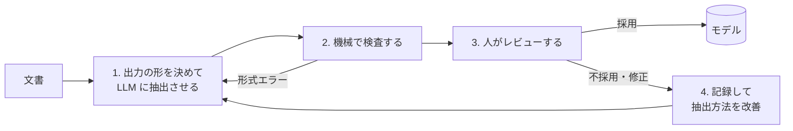

# 第18章 AI にオントロジーを作らせる

オントロジーづくりで一番手間がかかるのは、文書や専門家の頭の中にある知識を、概念・関係・ルールの形に書き起こす作業です。LLM はこの作業の下書きを作るのが得意です。この章では、LLM に候補を作らせ、人が確定させる進め方を説明します。

## 18.1 何を作らせるか

| 作らせるもの | 入力 | 出力の例 |
|------------|------|---------|
| 概念の候補 | 業務マニュアル、用語集、仕様書 | 「顧客」「見込み客」「取引先」と、それぞれの定義案 |
| 関係の候補 | 同上 | 「顧客 は 担当営業 を持つ」「契約 は 顧客 と 商品 を結ぶ」 |
| ルールの候補 | 規程、法令、審査基準 | 「年間売上 100 万円超かつ延滞なし → 優良顧客」 |
| 事実（インスタンス）の候補 | 契約書、報告書、メール | 「契約 C-123: 売主 A 社、買主 B 社、代金 300 万円」 |
| 標準語彙との対応の候補 | 自社の概念と標準語彙の定義 | 「自社の『取引先』は schema.org の `Organization` に近い」 |

## 18.2 進め方



### 1. 出力の形を決めて抽出させる

自由な文章で答えさせると、後の処理がしにくくなります。**出力の形（YAML・JSON のスキーマ）を決めて**、その形で出力させます。このリポジトリなら、規範の YAML の書式（第24章）がそのまま出力の形になります。

```yaml
# 「民法557条1項から規範の候補を、この形で出力してください」
- id: D557-buyer
  label: 手付解除（買主による手付放棄）
  category: extinguishing
  exception-of: [G555-price]
  sources:
    - path: a557/p1
      quote: 買主はその手付を放棄し        # ← 条文からの引用。機械で照合できる
  when:
    all:
      - fact: N557.deposit-agreement
        label: 売買契約に付随して、買主が売主に手付を交付する旨の合意をしたこと
      ...
```

ポイントは、**根拠の原文を引用させる**ことです（`quote`）。引用は、元の文書にその文字列があるかを機械で照合できます。

### 2. 機械で検査する

LLM の出力を、人が見る前に機械で検査します。

| 検査 | 例 |
|------|-----|
| 形式 | 必須項目があるか、値が決められた範囲か |
| 参照 | 参照先の概念・ルールが存在するか |
| 引用 | 引用した原文が、元の文書に本当にあるか |
| 論理 | ルールの循環がないか、矛盾がないか |
| 一貫性 | 同じ用語の定義が、場所によって食い違っていないか |

このリポジトリでは、規範を読み込むときに、これらをすべて自動で検査しています。とくに引用の照合は、LLM がもっともらしい条文を作り出してしまう誤り（ハルシネーション）を確実に見つけられます。

### 3. 人がレビューする

機械の検査を通った候補を、分野をよく知る人が確認します。

- 確認するのは「正しいか」だけでなく、「抜けていないか」（例外の見落とし）も
- 採否と理由を記録する
- 確認の状態（未確認・確認済み・疑義あり）をモデルに持たせる（第21章）

### 4. 記録して改善する

不採用や修正の理由を集めると、抽出の指示（プロンプト）や、出力の形の改善点が見えてきます。

## 18.3 品質を測る

抽出の品質は、正解のわかっている小さなデータで測ります。

| 指標 | 意味 |
|------|------|
| 採択率 | 人のレビューで採用された候補の割合 |
| 修正率 | 採用されたが修正が必要だった割合 |
| 見落とし率 | 正解にあるのに、候補に出てこなかったものの割合 |
| 機械検査の不合格率 | 形式・引用・論理の検査で落ちた割合 |

このリポジトリの提案書では、フェーズ4で「LLM による条文 → 規範候補、事案の叙述 → 事実候補の抽出」を行い、レビューの採択率を測る計画にしています。

## 18.4 注意すること

- **候補を確定させる判断は人が行う**: 抽出の量が増えると、レビューが形だけになりがちです。1 件あたりのレビュー時間や、差し戻しの件数を見て、形骸化していないかを確かめます
- **根拠のない候補は捨てる**: 原文の引用がない、照合できない候補は採用しない
- **例外の見落としに注意**: LLM は原則のルールは拾いやすいですが、「ただし」「前項の規定にかかわらず」といった例外や、別の条文にある例外を見落とすことがあります。条文の参照関係（第23章）を使って、関連する条文をまとめて渡すと改善します
- **機密情報の扱い**: 社内文書を外部の LLM サービスに渡してよいか、契約と社内規程を確認します

## まとめ

- LLM には、概念・関係・ルール・事実の候補を作らせる
- 出力の形を決め、根拠の原文を引用させ、機械で検査してから人がレビューする
- 採択率・修正率・見落とし率で品質を測り、抽出方法を改善する
- 確定の判断は人が行い、確認の状態を記録する
