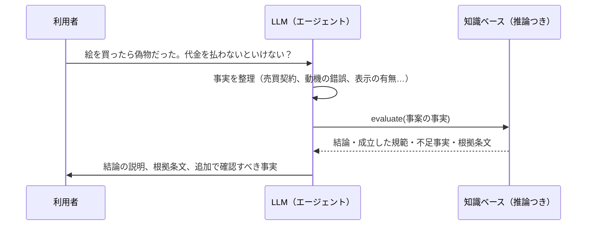

# 第19章 AI に知識ベースを使わせる

この章では、LLM が回答するときに、オントロジー（知識グラフとルール）を参照させる方法を説明します。目的は、回答を正確にし、根拠を示せるようにすることです。

## 19.1 RAG の基本と限界

LLM に社内の知識を答えさせる方法として広く使われているのが **RAG（Retrieval-Augmented Generation、検索拡張生成）**です。

1. 質問に関係しそうな文書の断片を検索する（ベクトル検索など）
2. 見つけた断片を LLM に渡して回答させる

RAG は手軽ですが、次のような質問は苦手です。

| 苦手な質問 | 理由 |
|-----------|------|
| 「A 社の親会社の取引先のうち、延滞があるのは？」 | 関係を何段もたどる必要があり、1 つの文書には書かれていない |
| 「この条件で補助金を受けられる？」 | ルールを正確に当てはめる必要があり、文書の断片の類似度では決まらない |
| 「全体として、どんな傾向がある？」 | 多数の文書をまとめる必要がある |
| 「なぜそう言えるの？」 | 断片を渡しただけでは、推論の過程を示せない |

## 19.2 GraphRAG: グラフを使った検索

**GraphRAG** は、文書から抽出した知識グラフ（モノと関係）を検索に使う方法の総称です。Microsoft Research が 2024 年に発表した手法がよく知られていて、文書からモノと関係を抽出してグラフを作り、グラフの中のまとまり（コミュニティ）ごとに要約を作っておくことで、「全体としてどんな傾向があるか」のような質問に答えやすくしています。

一般的には、次のような使い方をします。

| 使い方 | 内容 |
|-------|------|
| 関係をたどって集める | 質問に出てくるモノから、グラフを数段たどって関連する情報を集め、LLM に渡す |
| 要約を使う | グラフのまとまりごとの要約を使って、全体的な質問に答える |
| 文書の断片と組み合わせる | グラフで関係をたどり、関係の出どころの文書の断片も一緒に渡す |

## 19.3 知識ベースを「ツール」として呼ばせる

もう一歩進んだ方法が、LLM に**知識ベースへの問い合わせを道具（ツール）として使わせる**方法です。最近の LLM は、決められた形式で外部の関数を呼び出す機能（ツール呼び出し、関数呼び出し）を持っています。Anthropic が公開した **MCP（Model Context Protocol）** は、AI がこうした外部のツールやデータにつながるための共通の仕組みです。

このとき、LLM がやるのは「質問の理解」「事実の整理」「ツールの呼び出し」「結果の説明」で、**判定そのものは知識ベースの推論が行います**（第17章の原則1）。

知識ベースをツールとして公開するときは、次のような粒度にすると LLM が使いやすくなります。

| ツールの例 | 返すもの |
|-----------|---------|
| `search_concept(語)` | 概念の候補と定義（表記ゆれを吸収） |
| `get_neighbors(ID, 関係)` | 関係でつながるモノ |
| `evaluate(事案)` | 判定の結論と根拠、不足している情報 |
| `explain(結論ID)` | 推論の過程（どのルールのどの条件を使ったか） |
| `get_source(ID)` | 根拠の原文（条文、規程） |

このリポジトリの `legal-onto evaluate` と `legal-onto text`、`legal-onto refs` は、まさにこのようなツールの候補です。

## 19.4 回答を検証する

LLM の回答を、知識ベースで**後から検証する**使い方もあります。

1. LLM が回答と、その根拠（「民法 95 条 3 項により…」）を書く
2. 根拠に挙げた条文・データが実在するか、知識ベースで照合する
3. 主張している結論が、知識ベースの推論結果と一致するかを確かめる
4. 一致しなければ、回答を差し戻すか、利用者に警告する

これは第18章の「引用の照合」と同じ考え方を、回答の段階に当てはめたものです。

## 19.5 設計のヒント

- **LLM に渡す情報には ID と出どころを付ける**: 回答に ID を含めさせれば、根拠を機械的にたどれる
- **判定の結果だけでなく「不足している情報」も返す**: LLM はそれを使って、利用者に追加の質問ができる
- **知識ベースが答えられない範囲を明示する**: 「この時点に適用される規範は未登録」のような情報を返し、LLM が推測で埋めないようにする（このリポジトリの評価レポートは、この警告を出します）
- **LLM の説明と知識ベースの結論を並べて表示する**: 利用者が両者の食い違いに気づけるようにする

## まとめ

- RAG は手軽だが、関係を何段もたどる質問、ルールの正確な適用、根拠の説明が苦手
- GraphRAG は、知識グラフを検索に使って、関係の探索や全体的な質問に答えやすくする
- 知識ベースをツールとして LLM に呼ばせれば、判定は推論が、言葉は LLM が担う分担になる
- LLM の回答を知識ベースで検証する使い方もある
