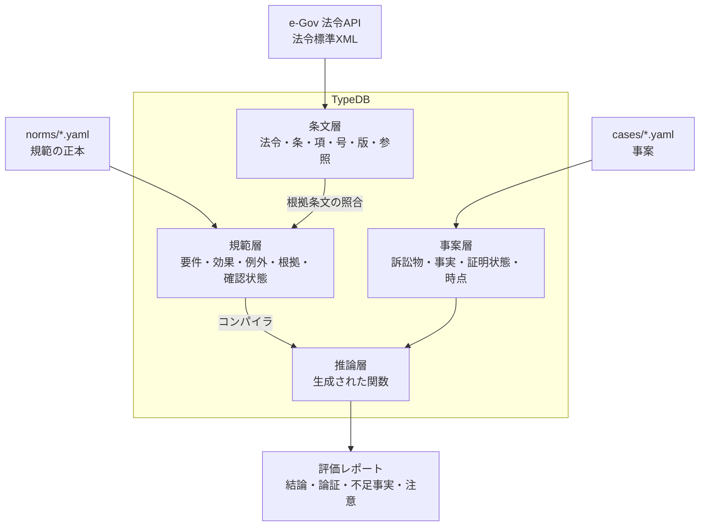

# 第22章 プロジェクトの全体像

第5部では、このリポジトリ（TypeDB で民法を扱うプロジェクト）を実例として、ここまでの考え方が実際にどう使われているかを読み解きます。

## 22.1 何を作っているか

このプロジェクトは、民法のルールを TypeDB 上に表し、**実務家（弁護士や企業の法務担当者）の判断を補助する**ためのものです。答えたい問いは次の 4 つです（第9章の「問いから始める」）。

| 問い | 例 |
|-----|-----|
| 結論 | この事実関係で、売主の代金支払請求は認められるか |
| 不足事実 | 結論を変えるには、どちらの当事者が、どの事実を立証すればよいか |
| 根拠 | その結論は、どの条文・判例に基づくか |
| 影響 | ある条文が改正されたら、どのルール・どの事案の結論が変わりうるか |

対象は、民法の**意思表示**（93〜98 条の 2）、**売買**（555 条以下）、**消滅時効**（144 条以下）に絞っています。

## 22.2 4 層の構成



| 層 | 中身 | オントロジーの考え方 | 章 |
|----|------|------------------|----|
| 条文層 | 法令の条・項・号の木構造、改正ごとの文言、条文間の参照 | 共通 ID（第6章）、推移的な関係（第4章）、時点つきのデータ | 23 |
| 規範層 | 「要件がそろえば効果が生じる、ただし例外がある」というルール | ルール（第4章）、原則と例外、根拠との対応 | 24 |
| 推論層 | 規範から生成した TypeQL 関数 | 層化否定（第5章）、関数による推論（第13章） | 25 |
| 事案層 | 当事者・事実・証明状態 | 「わからない」を明示的に持つ（第5章） | 26 |

## 22.3 なぜ TypeDB か

提案書では、5 つの方式（条文だけを持つ、規範をデータで持つ、規範を関数で書く、外部の推論エンジン、LLM による抽出）を比べた上で、TypeDB を選びました。主な理由は次のとおりです（第16章の観点）。

- **n 項関係とロール**: 「売買契約」「割り当て」のような関係を、そのまま表せる
- **関数による推論が、層化否定に対応している**: 法律の「原則 → 例外 → 例外の例外」をそのまま書ける（第5章・第14章）
- **強い型検査**: ルールを自動生成するので、生成したコードの誤りが定義の時点で見つかるのは大きな利点

一方で、標準化されていない、情報が少ない、という弱点もあります。実際、ドキュメントからはわからない挙動を実機で多く見つけました（第25章、第27章）。

## 22.4 前提となった決定

着手前に、利用者（このリポジトリの持ち主）と次の 4 点を決めました。

| 論点 | 決定 | 設計への影響 |
|------|------|------------|
| 用途 | 実務家の支援 | 正確さと根拠の提示が必須 |
| 対象分野 | 意思表示・売買・消滅時効 | 規範は数十件から始める |
| 実行環境 | docker compose で TypeDB、Python | 手元で再現できる構成 |
| 専門家のレビュー | 確保できない | **「確認済み」を前提にしない設計**（第21章） |

とくに最後の点が重要です。実務で使うのに専門家の確認がない、という緊張関係を、次の方法で扱っています。

- 規範ごとに典拠と確認状態を持たせる
- 根拠条文の文言を自動で照合する
- 出力のたびに、未確認の規範を使ったことを表示する
- 出力を「判断」ではなく「論点整理と立証計画の補助」と位置づける

## 22.5 リポジトリの構成

```
docker-compose.yml          TypeDB CE 3.13.6
schema/                     スキーマと固定の関数
  01-provisions.tql           条文層
  02-norms.tql                規範層
  03-cases.tql                事案層
norms/                      規範の正本（YAML）
cases/                      事案の例
src/legal_onto/             Python のコード
  egov.py  lawxml.py  refs.py  versions.py  loader.py   条文層の取り込み
  norms.py  compiler.py                                 規範層と推論層
  cases.py                                              事案の評価と報告
  cli.py                                                コマンド（legal-onto）
tests/                      テスト（事案テストを含む）
docs/proposal/              提案書と、各フェーズの結果
docs/userguide/             この本
```

## 22.6 動かしてみる

```bash
docker compose up -d
python -m venv .venv
.venv/Scripts/python -m pip install -e ".[dev]"
.venv/Scripts/legal-onto init-db
.venv/Scripts/legal-onto import-law 129AC0000000089      # 民法を取り込む（約 30 秒）
.venv/Scripts/legal-onto load-norms                       # 規範を検証・コンパイル
.venv/Scripts/legal-onto evaluate cases/demo-001.yaml     # 例題を評価
```

例題は、「2024 年 5 月、買主 Y が売主 X から絵画を 300 万円で買った。Y は有名画家の真作と信じ、そのことを X に伝えていたが、贋作だった。Y は錯誤を理由に契約を取り消した」という事案です。次の章から、この例題がどう処理されるかを層ごとに見ていきます。

## まとめ

- 民法のルールを TypeDB 上に表し、結論・不足事実・根拠・影響に答える、実務家向けの補助システム
- 条文層・規範層・推論層・事案層の 4 層で構成する
- 専門家の確認がない前提で、典拠・確認状態・自動照合・出力の表示で信頼性を補っている
