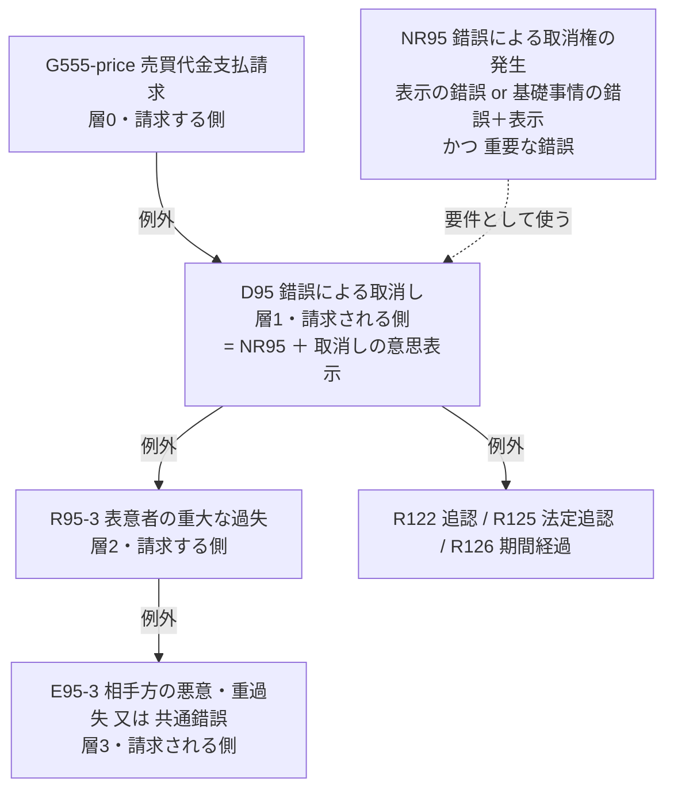

# 第24章 規範層: 法律のルールをデータにする

規範層は、民法のルール（規範）を「要件 → 効果、ただし例外あり」という形のデータで持つ層です。この章では、まず法律側の考え方（要件事実論）を簡単に説明し、それをどうデータにしたかを見ます。

## 24.1 要件事実論を 5 分で

民事訴訟では、裁判所は「請求が認められるか」を、次のような層の構造で判断します。

| 層 | 名前 | 主張・立証する側 | 例（代金請求） |
|---:|------|----------------|--------------|
| 0 | 請求原因 | 請求する側（原告） | 売買契約を結んだ |
| 1 | 抗弁 | 請求される側（被告） | 錯誤で取り消した |
| 2 | 再抗弁 | 請求する側 | 被告に重大な過失があった（だから取り消せない） |
| 3 | 再々抗弁 | 請求される側 | 原告は被告の錯誤を知っていた（だから重過失でも取り消せる） |

各層の事実は、それを主張する側が立証する責任を負います（**証明責任**）。立証できなかった（真偽不明だった）事実は、「なかった」ものとして扱われます。

この「原則 → 例外 → 例外の例外」と「証明できなければ、なかったことになる」は、第5章の**層化否定**と同じ構造です。この対応が、このプロジェクトの土台です。

## 24.2 規範を YAML で書く

規範は `norms/*.yaml` に書きます。これが規範の**正本**で、TypeDB にはここから読み込みます。例として、錯誤の再抗弁（95 条 3 項）を見ます。

```yaml
- id: R95-3
  label: 表意者の重大な過失
  effect: mistake-cancellation-barred
  category: impeding                 # 効果の種類（発生・障害・消滅・阻止）
  exception-of: [D95]                # D95（錯誤取消しの抗弁）の例外として働く
  valid-from: 2020-04-01             # 改正後の規定
  time-anchor: declaration           # 意思表示の時点で判定する
  stance: 条文
  sources:
    - path: a95/p3
      quote: 錯誤が表意者の重大な過失によるものであった場合には
  authority:
    - 民法95条3項柱書
  when:
    fact: N95-3.gross-negligence
    label: 錯誤が、請求される側（表意者）の重大な過失によるものであったこと
    evaluative: true                 # 規範的要件（評価は人が入力する）
```

| 項目 | 意味 | オントロジーの考え方 |
|------|------|------------------|
| `exception-of` | どの規範の例外か | 原則と例外の関係（第5章） |
| `when` | 要件の木（`all`・`any`・`fact`・`norm`） | ルールの条件（第4章） |
| `sources` / `quote` | 根拠条文と、その文言の引用 | 条文層への関係、機械照合（第18章） |
| `authority` | 典拠 | 典拠の必須化（第21章） |
| `valid-from` / `time-anchor` | 適用期間と、それを判定する時点 | 時点つきのルール |
| `evaluative` | 人の評価が要る要件か | 「わからない」を人が埋める部分の明示 |

### なぜ YAML を正本にしたか

提案書では、TypeDB の規範層を正本にする計画でした。実装では、YAML ファイルを正本にし、TypeDB はその写しにしました。専門家のレビューがない分、**変更を Git の差分で確認でき、履歴が残る**形にしたかったからです。

## 24.3 錯誤の規範の全体

95 条まわりの規範は、次のような構造になっています。



`NR95` は単独では抗弁にならない「部品」（`auxiliary`）で、`D95` の要件として使います。複数の規範で同じ要件のまとまりを使い回すためです（Java でいえば、共通処理をメソッドに切り出すのと同じ発想です）。

## 24.4 読み込み時の検証

`legal-onto load-norms` は、規範を TypeDB に入れる前に、次の検証をすべて行います（`src/legal_onto/norms.py`）。

| 検証 | 内容 |
|------|------|
| 書式 | 必須項目、値の範囲、参照先の規範があるか |
| 典拠 | `authority` がない規範は拒否 |
| 層化 | 例外関係と規範の参照に循環がないか |
| 証明責任 | 層を例外関係から計算し、偶奇が一意か（偶数なら請求する側、奇数なら請求される側） |
| 要件事実の一貫性 | 同じ要件事実の説明が、規範の間で食い違っていないか |
| 根拠条文 | 条文層に規定があり、`valid-from` の時点の文言に `quote` が含まれるか |

最後の検証は、条文番号の書き間違いや、条文にない文言（AI が作り出したものを含む）を確実に見つけます。現在の 29 規範は、すべてこの照合を通っています。

**証明責任を計算で決めている**点にも注目してください。人が規範ごとに「この事実は原告が立証する」と書くと、書き間違いが起きます。層から機械的に決めれば、矛盾があれば検証で見つかります。

## 24.5 時点と経過措置

2020 年の債権法改正には、「改正前にされた意思表示には、なお従前の例による（旧法を適用する）」という**経過措置**があります（平成 29 年法律第 44 号附則）。規範ごとに、どの時点で新旧を判定するかを `time-anchor` で指定しています。

| time-anchor | 時点 | 附則 | 使っている規範 |
|-------------|------|------|------------|
| `declaration` | 意思表示の時 | 6 条 1 項 | 93 条、95 条、96 条 2 項 |
| `contract` | 契約締結の時 | 34 条 1 項 | 557 条 |
| `claim-arose` | 債権が生じた時 | 10 条 1 項・4 項 | 145 条、147 条、152 条、166 条 |

改正前の規範（旧 95 条など）はまだ登録していないので、改正前の事案では警告を出します（フェーズ 3 の予定）。

## 24.6 登録した規範

| 層 | 規範 |
|---:|------|
| 0 | 売買代金支払請求、目的物引渡請求（555 条） |
| 1 | 弁済（473 条）、同時履行の抗弁（533 条）、心裡留保（93 条）、通謀虚偽表示（94 条）、錯誤取消し（95 条）、詐欺・第三者の詐欺・強迫による取消し（96 条）、手付解除（557 条）、消滅時効（166 条・145 条） |
| 2 | 反対給付の提供・先履行の合意（533 条）、表意者の重過失（95 条 3 項）、追認・法定追認・取消権の期間（122〜126 条）、履行の着手・解約手付としない合意（557 条）、裁判上の請求等・承認・時効完成後の承認（147 条・152 条・判例） |
| 3 | 相手方の悪意・重過失又は共通錯誤（95 条 3 項各号）、異議の留保（125 条ただし書） |

すべて `review-status: unreviewed`（専門家未確認）です。根拠条文の文言は自動照合済みですが、要件の立て方と証明責任の配分は、典拠に基づいて書いたもので、典拠の頁との照合はしていません。

## まとめ

- 要件事実論の「請求原因 → 抗弁 → 再抗弁」は、層化否定と同じ構造
- 規範は YAML で書き、要件の木・例外関係・根拠条文・典拠・適用期間・確認状態を持つ
- 読み込み時に、循環・証明責任・根拠条文の文言などを自動で検証する
- 証明責任は、例外関係の層から機械的に決める
