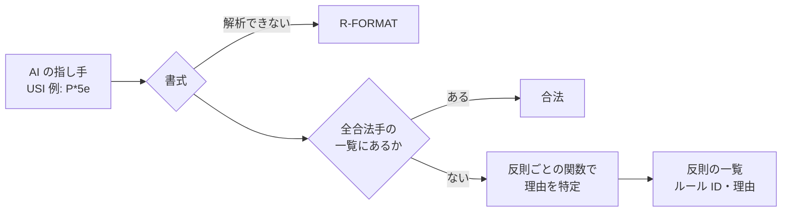
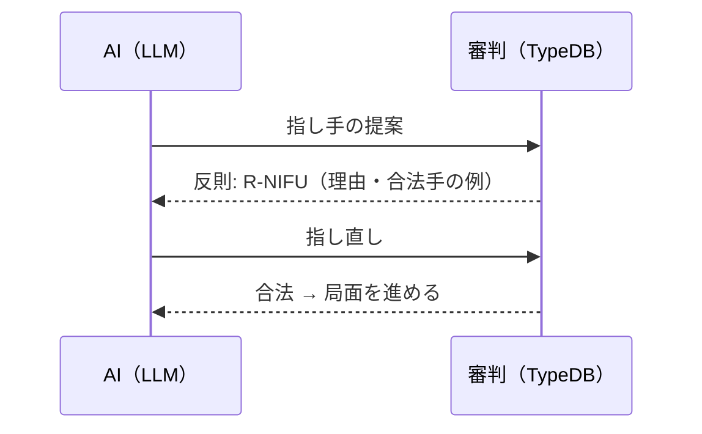

# 第29章 AI の指し手を判定する

この章では、AI が提案した指し手を TypeDB のルールで判定し、反則なら理由を返す仕組みを見ます。第17章の「判定はオントロジー、言葉は LLM」を具体化したものです。

## 29.1 判定の 2 段階

指し手の判定は、次の 2 段階で行います。



1. その局面の**全合法手**を TypeDB の関数で求めておき、指し手が一覧にあれば合法
2. なければ、**反則ごとの関数**を呼んで、どのルールに反するかを特定する

全合法手を先に求めるのは、審判として「指す側に合法手がない＝詰み」も判定する必要があるからです。また、合法手の一覧は AI への「指し直しの手がかり」にも使えます。

## 29.2 合法手 = 疑似合法手 − 禁じ手

合法手は、「駒の動きとして可能な手（疑似合法手）」から「禁じ手」を除いて求めます。第5章の「原則から例外を除く」と同じ構造です。

```typeql
# 合法手（盤上の移動・成らない）
fun legal_moves_unpromoted($p: position) -> { square, square, piece-type }:
match
  let $s, $t, $pt in board_moves($p);                     # 疑似合法手（移動元・移動先・駒）
  not { let $x in must_promote($p, $pt, $t); };            # 成らないと行き所がない手は除く
  not { let $y in leaves_check($p, $s, $t, $pt); };        # 自玉に王手が残る手は除く
return { $s, $t, $pt };
```

関数が「移動元・移動先・駒」の組を返している点に注目してください。TypeDB の関数は、概念（エンティティ）の組を返せます。

持ち駒を打つ手も同じ形です。空きマスのうち、行き所のない段・二歩・王手放置に当たらないマスを返します。

## 29.3 仮想の盤: 指した後の局面を書き込まずに判定する

「王手放置」（指した後に自分の玉に王手がかかる手）を判定するには、指した後の局面が必要です。最初の設計では、指した後の局面をデータベースに書き込んでから判定するつもりでした。しかし、全合法手を求めるには候補手ごとに局面を書き込むことになり、遅すぎました。

そこで、**指した後の盤を関数で表す**「仮想の盤」を作りました。

```typeql
# 指した後に $q に駒があるか: 移動先には駒がある。移動元は空く。それ以外は元の局面のまま
fun occupied_after($p: position, $q: square, $f: square, $t: square) -> { square }:
match
  { $q is $t; } or
  { let $x in occupied_except($p, $q, $f); };
return { $q };
```

王手の判定は、玉のマスから各方向に**逆向きに**たどり、最初にぶつかった駒が「その向きに利く相手の駒」かを調べます。相手の全部の駒の利きを計算するより、ずっと少ない計算で済みます。

RDB でいえば、`UPDATE` してから `SELECT` する代わりに、「更新後の状態」を返すビューを作って問い合わせるのに近い考え方です。データを書かずに「もし〜したら」を問い合わせられるのは、ルールを関数で持っている利点です。

### 打ち歩詰めだけは局面を書き込む

打ち歩詰め（歩を打って相手の玉を詰ませる禁じ手）の判定には、「歩を打った後の局面で、相手のすべての指し手について、指した後に王手が残るか」という **2 手先**までの評価が必要です。ここだけは仮想の盤を 2 重にせず、歩を打った後の局面を実際に書き込んで、相手の合法手があるかを問い合わせます。歩を打って王手になる手だけが対象なので、全体への影響は小さく済みます。

## 29.4 反則ごとの関数と、理由の文

合法手の一覧にない指し手は、反則ごとの関数で理由を特定します。民法の「規範ごとの関数」と同じ形で、反則なら局面を返します。

```typeql
# R-NIFU 二歩
fun v_nifu($p: position, $pt: piece-type, $t: square) -> { position }:
match
  turn (position: $p, player: $pl);
  let $x in nifu($p, $pl, $pt, $t);
return { $p };
```

| ルール ID | 反則 |
|----------|------|
| R-FORMAT | 指し手の書式が解析できない |
| R-NO-PIECE / R-TURN / R-OWN / R-MOVE | 駒がない、相手の駒、自分の駒のマス、動けないマス |
| R-PROMO-ZONE / R-PROMO-PIECE / R-PROMO-MANDATORY | 成れない場所・成れない駒・成らなければならない駒 |
| R-DROP-HAND / R-DROP-EMPTY / R-DEADEND-DROP | 持っていない駒・駒のあるマス・行き所のない段に打つ |
| R-NIFU / R-UCHIFUZUME / R-SELF-CHECK | 二歩・打ち歩詰め・王手放置 |

判定結果は、AI がそのまま読める JSON で返します。

```json
{
  "move": "P*5e",
  "legal": false,
  "violations": [
    {
      "rule": "R-NIFU",
      "label": "二歩",
      "reason": "5筋に先手の歩（5七）があるため、5筋に歩を打てない",
      "rule_text": "成っていない自分の歩がある筋に、歩を打てない",
      "source": "日本将棋連盟 対局規定（反則）— 条文との照合は未了"
    }
  ],
  "legal_move_count": 30,
  "legal_move_examples": ["1g1f", "1i1h", "2g2f", "2h1h", "2h3h"]
}
```

理由の文（`reason`）は、判定関数が見つけたマスと駒から、決まった型の文で作ります。LLM に書かせると、もっともらしいが誤った理由を書くおそれがあるからです（第17章の「根拠はオントロジーから取る」）。

## 29.5 審判として対局を進める

対局の審判（`src/shogi_referee/game.py`）は、1 手ごとに判定し、局面を進め、対局の終了を判定します。

| モード | 用途 | 反則のとき |
|-------|------|----------|
| strict | AI 対局の審判 | 公式ルールどおり反則負け |
| retry | LLM の評価 | 理由を返して、上限回数まで指し直させる |

| 終了 | 判定 |
|------|------|
| 詰み | 手番の側に合法手がない |
| 反則 | strict モードで反則の指し手 |
| 千日手 | 同じ局面（盤・持ち駒・手番）が 4 回 |
| 連続王手の千日手 | 千日手のうち、一方の手がすべて王手だった。王手をかけた側の負け |
| 最大手数 | 決めた手数に達した（AI 同士の対局で一般的な打ち切り） |
| 投了 | AI が投了を宣言 |

```bash
shogi-referee judge "<SFEN>" "P*5e"               # 1 手の判定（JSON）
shogi-referee replay 7g7f 3c3d 8h2b+ --mode strict  # 指し手を順に審判
```

## 29.6 AI との「提案と判定」のループ



LLM は将棋の指し手を文章で提案できますが、局面が複雑になると盤面の把握を誤り、二歩や王手放置をすることがあります。審判は反則を確実に止め、ルール ID と理由を返します。LLM はその理由を読んで指し直します。

評価では、試行ごとに判定結果を記録し、次のような指標を集計する計画です（未実装）。

| 指標 | 意味 |
|------|------|
| 1 回目の合法率 | 最初の提案が合法だった割合 |
| 反則の種類別の率 | どのルール ID の反則が多いか |
| 指し直しによる回復率 | 理由を返したあと合法手を指せた割合 |

ルール ID が集計のキーになるので、「この LLM は二歩はしないが、王手放置をしやすい」のように、ルール単位で理解の度合いを測れます。ルールに ID を付けてデータとして持つことの効果です。

## まとめ

- 判定は「全合法手の一覧にあるか」と「反則ごとの関数で理由を特定する」の 2 段階
- 合法手は「疑似合法手 − 禁じ手」。原則と例外の構造
- 指した後の盤を関数で表す「仮想の盤」で、局面を書き込まずに王手放置を判定する
- 判定結果は、ルール ID・具体的な理由・合法手の例を JSON で返し、AI の指し直しと評価の集計に使う
